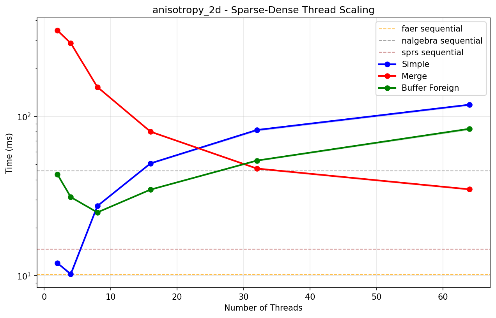
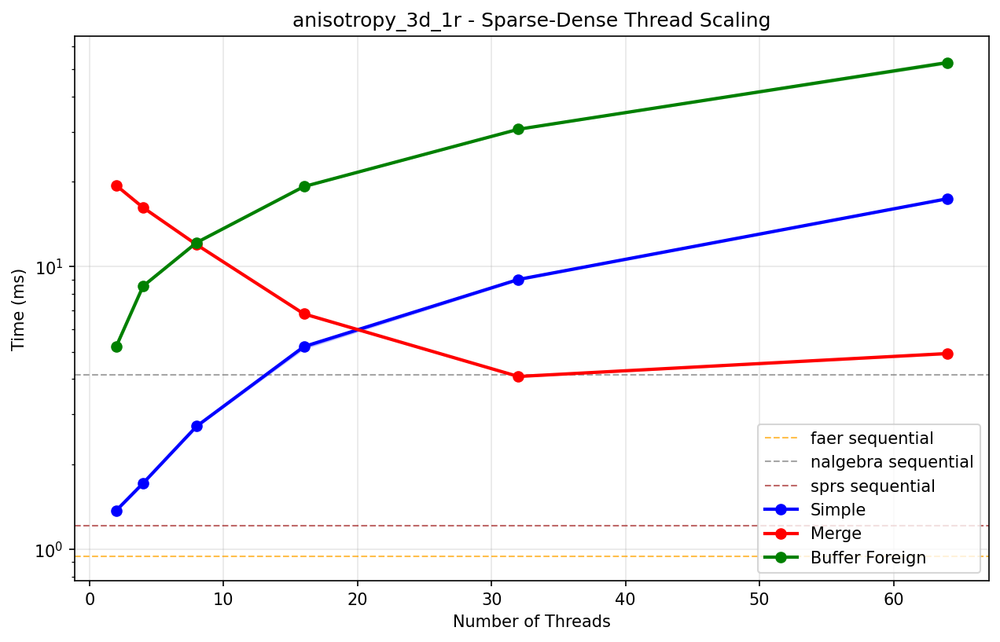
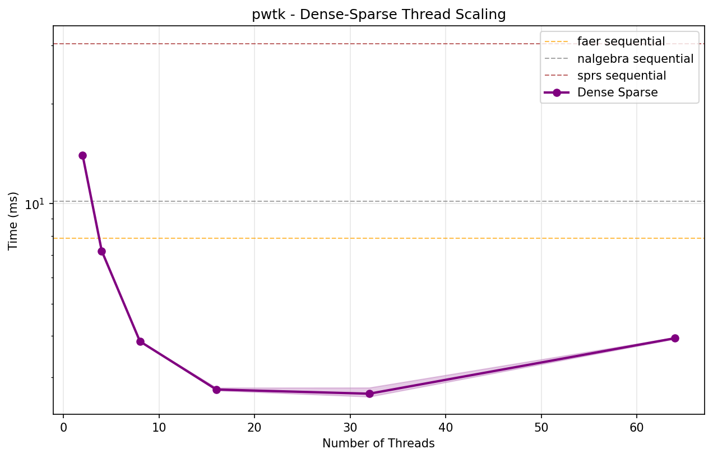

# Sequential Sparse-Dense Matrix-Vector Multiplication Benchmark Results

| Matrix | Dimensions | Non-zeros | faer | nalgebra | sprs |
|--------|------------|-----------|------|----------|------|
| **0** | 18x18 | 18 | **33.70 ns ± 0.03 ns** | 190.76 ns ± 0.08 ns | 78.70 ns ± 0.01 ns |
| **1** | 51x51 | 79 | **92.47 ns ± 0.07 ns** | 344.03 ns ± 0.04 ns | 221.29 ns ± 0.03 ns |
| **2** | 165x165 | 469 | **403.20 ns ± 0.09 ns** | 1.67 µs ± 0.12 ns | 850.40 ns ± 0.06 ns |
| **3** | 585x585 | 2,209 | **1.79 µs ± 0.07 ns** | 7.36 µs ± 0.47 ns | 3.28 µs ± 0.23 ns |
| **4** | 2193x2193 | 9,529 | **7.58 µs ± 0.25 ns** | 30.95 µs ± 1.44 ns | 13.03 µs ± 0.51 ns |
| **synthetic** | 1000x1000 | 10,000 | **6.36 µs ± 3.78 ns** | 29.36 µs ± 1.27 ns | 9.69 µs ± 0.73 ns |
| **5** | 8481x8481 | 39,529 | **31.51 µs ± 1.66 ns** | 127.75 µs ± 5.52 ns | 53.45 µs ± 1.20 ns |
| **6** | 33345x33345 | 160,969 | **131.00 µs ± 4.72 ns** | 519.94 µs ± 8.93 ns | 214.18 µs ± 23.37 ns |
| **7** | 132225x132225 | 649,609 | **530.21 µs ± 39.10 ns** | 2.10 ms ± 142.28 ns | 864.20 µs ± 78.05 ns |
| **anisotropy_3d_1r** | 84315x84315 | 1,373,557 | **945.65 µs ± 143.15 ns** | 4.14 ms ± 297.77 ns | 1.21 ms ± 94.61 ns |
| **boneS01_M** | 127224x127224 | 2,238,384 | **1.60 ms ± 161.40 ns** | 6.72 ms ± 735.16 ns | 1.94 ms ± 166.75 ns |
| **boneS01** | 127224x127224 | 5,516,602 | **3.72 ms ± 474.29 ns** | 16.77 ms ± 2.51 µs | 4.13 ms ± 619.19 ns |
| **Ga3As3H12** | 61349x61349 | 5,970,947 | **4.11 ms ± 316.34 ns** | 17.82 ms ± 7.44 µs | 4.45 ms ± 417.92 ns |
| **rajat30** | 643994x643994 | 6,175,244 | **5.75 ms ± 2.36 µs** | 21.66 ms ± 8.00 µs | 7.30 ms ± 1.14 µs |
| **m_t1** | 97578x97578 | 9,753,570 | **6.24 ms ± 485.86 ns** | 34.95 ms ± 4.56 µs | 6.84 ms ± 896.34 ns |
| **anisotropy_3d_2r** | 650621x650621 | 10,895,827 | **8.69 ms ± 7.96 µs** | 39.87 ms ± 12.17 µs | 10.30 ms ± 11.64 µs |
| **SiO2** | 155331x155331 | 11,283,503 | **8.11 ms ± 635.21 ns** | 39.48 ms ± 3.57 µs | 8.58 ms ± 531.90 ns |
| **pwtk** | 217918x217918 | 11,524,432 | **7.23 ms ± 772.02 ns** | 38.96 ms ± 4.15 µs | 8.26 ms ± 814.23 ns |
| **anisotropy_2d** | 1313281x1313281 | 11,763,231 | **10.21 ms ± 11.33 µs** | 45.42 ms ± 13.14 µs | 14.64 ms ± 20.04 µs |
| **kkt_power** | 2063494x2063494 | 12,771,361 | **14.14 ms ± 13.18 µs** | 53.74 ms ± 28.13 µs | 20.37 ms ± 21.73 µs |
| **crankseg_2** | 63838x63838 | 14,148,858 | **9.09 ms ± 926.58 ns** | 48.64 ms ± 8.40 µs | 9.86 ms ± 637.58 ns |
| **Freescale2** | 2999349x2999349 | 14,313,235 | **17.42 ms ± 6.79 µs** | 63.55 ms ± 41.54 µs | 27.51 ms ± 12.38 µs |
| **spe10_0** | 1159366x1159366 | 28,730,252 | **20.84 ms ± 1.69 µs** | 81.85 ms ± 2.91 µs | 23.02 ms ± 1.10 µs |
# Sequential Dense-Sparse Matrix-Vector Multiplication Benchmark Results

| Matrix | Dimensions | Non-zeros | faer | nalgebra | sprs |
|--------|------------|-----------|------|----------|------|
| **0** | 18x18 | 18 | **31.33 ns ± 0.03 ns** | 67.77 ns ± 0.01 ns | 82.10 ns ± 0.01 ns |
| **1** | 51x51 | 79 | **87.35 ns ± 0.02 ns** | 169.79 ns ± 0.01 ns | 225.55 ns ± 0.03 ns |
| **2** | 165x165 | 469 | **336.03 ns ± 0.03 ns** | 628.49 ns ± 0.06 ns | 868.86 ns ± 0.11 ns |
| **3** | 585x585 | 2,209 | **1.66 µs ± 0.05 ns** | 2.42 µs ± 0.13 ns | 3.43 µs ± 0.22 ns |
| **4** | 2193x2193 | 9,529 | **6.86 µs ± 0.19 ns** | 9.52 µs ± 0.62 ns | 13.76 µs ± 4.28 ns |
| **synthetic** | 1000x1000 | 10,000 | **5.45 µs ± 1.64 ns** | 7.14 µs ± 0.68 ns | 16.58 µs ± 0.69 ns |
| **5** | 8481x8481 | 39,529 | **29.50 µs ± 2.00 ns** | 38.72 µs ± 4.29 ns | 56.08 µs ± 7.65 ns |
| **6** | 33345x33345 | 160,969 | **121.94 µs ± 4.97 ns** | 160.80 µs ± 5.07 ns | 225.19 µs ± 12.53 ns |
| **7** | 132225x132225 | 649,609 | **487.19 µs ± 27.17 ns** | 655.29 µs ± 50.51 ns | 903.06 µs ± 69.36 ns |
| **anisotropy_3d_1r** | 84315x84315 | 1,373,557 | **798.70 µs ± 72.81 ns** | 1.10 ms ± 110.46 ns | 2.76 ms ± 429.06 ns |
| **boneS01_M** | 127224x127224 | 2,238,384 | **1.62 ms ± 288.75 ns** | 1.87 ms ± 108.43 ns | 4.45 ms ± 177.96 ns |
| **boneS01** | 127224x127224 | 5,516,602 | **3.88 ms ± 351.48 ns** | 4.72 ms ± 606.92 ns | 13.86 ms ± 384.44 ns |
| **Ga3As3H12** | 61349x61349 | 5,970,947 | **4.74 ms ± 569.02 ns** | 5.41 ms ± 854.78 ns | 17.50 ms ± 289.58 ns |
| **rajat30** | 643994x643994 | 6,175,244 | **5.64 ms ± 3.87 µs** | 7.43 ms ± 2.64 µs | 12.67 ms ± 2.53 µs |
| **m_t1** | 97578x97578 | 9,753,570 | **6.63 ms ± 786.48 ns** | 8.68 ms ± 1.87 µs | 28.57 ms ± 554.50 ns |
| **anisotropy_3d_2r** | 650621x650621 | 10,895,827 | **8.20 ms ± 4.85 µs** | 11.92 ms ± 6.72 µs | 22.53 ms ± 7.64 µs |
| **SiO2** | 155331x155331 | 11,283,503 | **8.84 ms ± 645.14 ns** | 12.69 ms ± 2.64 µs | 31.82 ms ± 773.62 ns |
| **pwtk** | 217918x217918 | 11,524,432 | **7.86 ms ± 1.61 µs** | 10.15 ms ± 2.75 µs | 30.38 ms ± 660.94 ns |
| **anisotropy_2d** | 1313281x1313281 | 11,763,231 | **10.31 ms ± 7.81 µs** | 15.28 ms ± 8.64 µs | 19.84 ms ± 4.26 µs |
| **kkt_power** | 2063494x2063494 | 12,771,361 | **14.35 ms ± 14.37 µs** | 22.95 ms ± 19.53 µs | 26.53 ms ± 13.71 µs |
| **crankseg_2** | 63838x63838 | 14,148,858 | **10.70 ms ± 1.36 µs** | 12.89 ms ± 3.83 µs | 44.07 ms ± 738.62 ns |
| **Freescale2** | 2999349x2999349 | 14,313,235 | **18.23 ms ± 10.00 µs** | 24.97 ms ± 8.90 µs | 31.35 ms ± 11.60 µs |
| **spe10_0** | 1159366x1159366 | 28,730,252 | **20.22 ms ± 1.55 µs** | 23.42 ms ± 3.48 µs | 60.35 ms ± 1.36 µs |

# Parallel Thread Scaling Results - Sparse-Dense Multiplication (`simple`)

| Matrix | Dimensions | Non-zeros | 2 Threads | 4 Threads | 8 Threads | 16 Threads | 32 Threads | 64 Threads |
|--------|------------|-----------|-----------:|-----------:|-----------:|-----------:|-----------:|-----------:|
| **anisotropy_3d_1r** | 84315x84315 | 1,373,557 | **1.423 ms** | 1.608 ms | 1.846 ms | 5.183 ms | 9.425 ms | 18.056 ms |
| **boneS01_M** | 127224x127224 | 2,238,384 | **1.681 ms** | 2.391 ms | 1.773 ms | 6.652 ms | 13.074 ms | 25.180 ms |
| **boneS01** | 127224x127224 | 5,516,602 | 3.007 ms | **1.706 ms** | 2.527 ms | 5.996 ms | 13.173 ms | 25.150 ms |
| **Ga3As3H12** | 61349x61349 | 5,970,947 | 2.741 ms | **1.618 ms** | 1.724 ms | 3.902 ms | 7.232 ms | 14.017 ms |
| **rajat30** | 643994x643994 | 6,175,244 | 10.083 ms | **9.675 ms** | 16.204 ms | 23.940 ms | 47.405 ms | 73.078 ms |
| **m_t1** | 97578x97578 | 9,753,570 | 4.136 ms | **2.183 ms** | 2.780 ms | 5.144 ms | 10.499 ms | 20.418 ms |
| **anisotropy_3d_2r** | 650621x650621 | 10,895,827 | **10.203 ms** | 11.030 ms | 17.117 ms | 31.243 ms | 48.747 ms | 74.118 ms |
| **SiO2** | 155331x155331 | 11,283,503 | 5.544 ms | **4.500 ms** | 4.505 ms | 8.091 ms | 15.693 ms | 29.410 ms |
| **pwtk** | 217918x217918 | 11,524,432 | 5.669 ms | **4.869 ms** | 5.845 ms | 9.560 ms | 21.260 ms | 37.996 ms |
| **anisotropy_2d** | 1313281x1313281 | 11,763,231 | **15.992 ms** | 17.215 ms | 29.596 ms | 46.397 ms | 67.757 ms | 87.176 ms |
| **kkt_power** | 2063494x2063494 | 12,771,361 | **18.571 ms** | 24.969 ms | 42.206 ms | 58.943 ms | 89.364 ms | 103.787 ms |
| **crankseg_2** | 63838x63838 | 14,148,858 | 5.502 ms | 3.638 ms | **2.830 ms** | 4.048 ms | 7.805 ms | 14.608 ms |
| **Freescale2** | 2999349x2999349 | 14,313,235 | **24.630 ms** | 33.728 ms | 52.137 ms | 69.512 ms | 86.582 ms | 106.590 ms |
| **spe10_0** | 1159366x1159366 | 28,730,252 | **17.520 ms** | 17.672 ms | 27.545 ms | 43.047 ms | 67.635 ms | 85.963 ms |

# Parallel Thread Scaling Results - Sparse-Dense Multiplication (`merge`)

| Matrix | Dimensions | Non-zeros | 2 Threads | 4 Threads | 8 Threads | 16 Threads | 32 Threads | 64 Threads |
|--------|------------|-----------|-----------:|-----------:|-----------:|-----------:|-----------:|-----------:|
| **anisotropy_3d_1r** | 84315x84315 | 1,373,557 | 46.027 ms | 23.698 ms | 13.013 ms | 6.901 ms | **4.272 ms** | 4.636 ms |
| **boneS01_M** | 127224x127224 | 2,238,384 | 64.197 ms | 33.244 ms | 16.235 ms | 8.315 ms | **5.087 ms** | 5.173 ms |
| **boneS01** | 127224x127224 | 5,516,602 | 157.532 ms | 79.794 ms | 41.545 ms | 19.376 ms | 9.325 ms | **8.196 ms** |
| **Ga3As3H12** | 61349x61349 | 5,970,947 | 160.232 ms | 80.540 ms | 44.760 ms | 20.114 ms | 10.431 ms | **8.175 ms** |
| **rajat30** | 643994x643994 | 6,175,244 | 240.665 ms | 124.560 ms | 65.830 ms | 37.869 ms | 17.760 ms | **10.933 ms** |
| **m_t1** | 97578x97578 | 9,753,570 | 210.737 ms | 104.975 ms | 52.912 ms | 26.032 ms | 12.509 ms | **8.999 ms** |
| **anisotropy_3d_2r** | 650621x650621 | 10,895,827 | 572.074 ms | 319.229 ms | 154.326 ms | 71.736 ms | 34.607 ms | **26.129 ms** |
| **SiO2** | 155331x155331 | 11,283,503 | 345.297 ms | 188.814 ms | 108.915 ms | 49.170 ms | 23.056 ms | **13.946 ms** |
| **pwtk** | 217918x217918 | 11,524,432 | 285.287 ms | 141.688 ms | 70.195 ms | 36.262 ms | 17.371 ms | **11.454 ms** |
| **anisotropy_2d** | 1313281x1313281 | 11,763,231 | 507.598 ms | 248.342 ms | 130.764 ms | 68.589 ms | 39.184 ms | **29.473 ms** |
| **kkt_power** | 2063494x2063494 | 12,771,361 | 716.679 ms | 377.466 ms | 203.521 ms | 104.020 ms | 59.304 ms | **42.749 ms** |
| **crankseg_2** | 63838x63838 | 14,148,858 | 348.770 ms | 171.245 ms | 81.409 ms | 40.826 ms | 19.112 ms | **12.937 ms** |
| **Freescale2** | 2999349x2999349 | 14,313,235 | 771.096 ms | 402.567 ms | 232.167 ms | 127.058 ms | 76.204 ms | **56.456 ms** |
| **spe10_0** | 1159366x1159366 | 28,730,252 | 925.878 ms | 469.055 ms | 240.338 ms | 115.942 ms | 59.656 ms | **45.178 ms** |

# Parallel Thread Scaling Results - Sparse-Dense Multiplication (`buffer_foreign`)

| Matrix | Dimensions | Non-zeros | 2 Threads | 4 Threads | 8 Threads | 16 Threads | 32 Threads | 64 Threads |
|--------|------------|-----------|-----------:|-----------:|-----------:|-----------:|-----------:|-----------:|
| **anisotropy_3d_1r** | 84315x84315 | 1,373,557 | **5.187 ms** | 8.057 ms | 11.470 ms | 17.145 ms | 26.927 ms | 46.329 ms |
| **boneS01_M** | 127224x127224 | 2,238,384 | 4.530 ms | **4.513 ms** | 6.458 ms | 19.787 ms | 31.899 ms | 50.437 ms |
| **boneS01** | 127224x127224 | 5,516,602 | 8.865 ms | **7.305 ms** | 8.704 ms | 24.397 ms | 39.757 ms | 62.088 ms |
| **Ga3As3H12** | 61349x61349 | 5,970,947 | **14.292 ms** | 15.582 ms | 23.906 ms | 30.534 ms | 41.935 ms | 67.292 ms |
| **rajat30** | 643994x643994 | 6,175,244 | **15.256 ms** | 16.779 ms | 25.734 ms | 35.870 ms | 50.078 ms | 77.418 ms |
| **m_t1** | 97578x97578 | 9,753,570 | **13.226 ms** | 21.198 ms | 19.711 ms | 33.413 ms | 43.010 ms | 69.144 ms |
| **anisotropy_3d_2r** | 650621x650621 | 10,895,827 | 38.050 ms | 26.701 ms | **23.158 ms** | 32.248 ms | 50.332 ms | 76.106 ms |
| **SiO2** | 155331x155331 | 11,283,503 | **27.920 ms** | 28.469 ms | 30.985 ms | 34.166 ms | 49.020 ms | 75.510 ms |
| **pwtk** | 217918x217918 | 11,524,432 | 19.879 ms | **18.614 ms** | 20.794 ms | 32.077 ms | 46.124 ms | 71.367 ms |
| **anisotropy_2d** | 1313281x1313281 | 11,763,231 | 43.877 ms | 31.413 ms | **26.757 ms** | 34.402 ms | 48.894 ms | 76.011 ms |
| **kkt_power** | 2063494x2063494 | 12,771,361 | 69.628 ms | 47.323 ms | 38.422 ms | **34.839 ms** | 49.889 ms | 78.684 ms |
| **crankseg_2** | 63838x63838 | 14,148,858 | 34.242 ms | **27.193 ms** | 28.772 ms | 35.958 ms | 46.926 ms | 72.506 ms |
| **Freescale2** | 2999349x2999349 | 14,313,235 | 66.203 ms | 38.933 ms | **30.083 ms** | 36.412 ms | 50.059 ms | 76.614 ms |
| **spe10_0** | 1159366x1159366 | 28,730,252 | 42.254 ms | 25.966 ms | **22.690 ms** | 41.291 ms | 61.848 ms | 80.971 ms |

# Parallel Thread Scaling Results - Dense-Sparse Multiplication (`dense_sparse`)

| Matrix | Dimensions | Non-zeros | 2 Threads | 4 Threads | 8 Threads | 16 Threads | 32 Threads | 64 Threads |
|--------|------------|-----------|-----------:|-----------:|-----------:|-----------:|-----------:|-----------:|
| **anisotropy_3d_1r** | 84315x84315 | 1,373,557 | 1.560 ms | 983.67 µs | **704.19 µs** | 739.36 µs | 1.356 ms | 2.772 ms |
| **boneS01_M** | 127224x127224 | 2,238,384 | 2.445 ms | 1.449 ms | 980.10 µs | **870.85 µs** | 1.518 ms | 2.914 ms |
| **boneS01** | 127224x127224 | 5,516,602 | 6.639 ms | 3.589 ms | 2.033 ms | **1.393 ms** | 1.762 ms | 3.064 ms |
| **Ga3As3H12** | 61349x61349 | 5,970,947 | 8.799 ms | 4.752 ms | 2.554 ms | **1.555 ms** | 1.597 ms | 2.928 ms |
| **rajat30** | 643994x643994 | 6,175,244 | 8.468 ms | 5.518 ms | 3.365 ms | **2.955 ms** | 3.220 ms | 3.951 ms |
| **m_t1** | 97578x97578 | 9,753,570 | 14.022 ms | 7.249 ms | 3.898 ms | 2.301 ms | **1.947 ms** | 3.154 ms |
| **anisotropy_3d_2r** | 650621x650621 | 10,895,827 | 12.412 ms | 7.689 ms | 5.225 ms | 4.043 ms | **3.958 ms** | 5.088 ms |
| **SiO2** | 155331x155331 | 11,283,503 | 15.683 ms | 9.011 ms | 4.834 ms | 2.845 ms | **2.197 ms** | 3.334 ms |
| **pwtk** | 217918x217918 | 11,524,432 | 14.281 ms | 7.537 ms | 4.217 ms | 2.669 ms | **2.335 ms** | 3.516 ms |
| **anisotropy_2d** | 1313281x1313281 | 11,763,231 | 14.627 ms | 10.489 ms | 8.403 ms | **7.146 ms** | 7.261 ms | 7.877 ms |
| **kkt_power** | 2063494x2063494 | 12,771,361 | 20.987 ms | 16.328 ms | 11.260 ms | 10.064 ms | **9.534 ms** | 11.855 ms |
| **crankseg_2** | 63838x63838 | 14,148,858 | 22.174 ms | 11.298 ms | 5.839 ms | 3.207 ms | **2.366 ms** | 3.264 ms |
| **Freescale2** | 2999349x2999349 | 14,313,235 | 26.102 ms | 20.602 ms | 15.243 ms | 13.930 ms | **13.751 ms** | 15.512 ms |
| **spe10_0** | 1159366x1159366 | 28,730,252 | 31.248 ms | 18.012 ms | 11.044 ms | 7.737 ms | **6.655 ms** | 7.586 ms |

## Thread Scaling Plots

### Freescale2 (2999349x2999349, 14,313,235 nnz, 0.000% dense)

<table><tr>
<td></td>
<td></td>
</tr></table>

### Ga3As3H12 (61349x61349, 5,970,947 nnz, 0.159% dense)

<table><tr>
<td></td>
<td></td>
</tr></table>

### SiO2 (155331x155331, 11,283,503 nnz, 0.047% dense)

<table><tr>
<td></td>
<td></td>
</tr></table>

### anisotropy_2d (1313281x1313281, 11,763,231 nnz, 0.001% dense)

<table><tr>
<td></td>
<td></td>
</tr></table>

### anisotropy_3d_1r (84315x84315, 1,373,557 nnz, 0.019% dense)

<table><tr>
<td></td>
<td></td>
</tr></table>

### anisotropy_3d_2r (650621x650621, 10,895,827 nnz, 0.003% dense)

<table><tr>
<td></td>
<td></td>
</tr></table>

### boneS01 (127224x127224, 5,516,602 nnz, 0.034% dense)

<table><tr>
<td></td>
<td></td>
</tr></table>

### boneS01_M (127224x127224, 2,238,384 nnz, 0.014% dense)

<table><tr>
<td></td>
<td></td>
</tr></table>

### crankseg_2 (63838x63838, 14,148,858 nnz, 0.347% dense)

<table><tr>
<td></td>
<td></td>
</tr></table>

### kkt_power (2063494x2063494, 12,771,361 nnz, 0.000% dense)

<table><tr>
<td></td>
<td></td>
</tr></table>

### m_t1 (97578x97578, 9,753,570 nnz, 0.102% dense)

<table><tr>
<td></td>
<td></td>
</tr></table>

### pwtk (217918x217918, 11,524,432 nnz, 0.024% dense)

<table><tr>
<td></td>
<td></td>
</tr></table>

### rajat30 (643994x643994, 6,175,244 nnz, 0.001% dense)

<table><tr>
<td></td>
<td></td>
</tr></table>

### spe10_0 (1159366x1159366, 28,730,252 nnz, 0.002% dense)

<table><tr>
<td></td>
<td></td>
</tr></table>

## Notes

- Times shown are median ± approximate standard deviation from Criterion benchmarks
- `faer` = faer built-in sequential sparse-dense matrix-vector multiplication
- `nalgebra` = nalgebra-sparse CSC matrix-vector multiplication
- `sprs` = sprs CSC matrix-vector multiplication
- `simple`, `merge`, `buffer_foreign` = different parallel sparse-dense algorithms
- `dense_sparse` = parallel dense-sparse matrix-vector multiplication implementation
- Thread scaling shows parallel implementation performance across different thread counts
- All measurements taken on the same system with consistent methodology
- Plots show thread scaling with 95% confidence intervals and sequential baselines

## System Information

```
Architecture:                         x86_64
CPU op-mode(s):                       32-bit, 64-bit
Address sizes:                        52 bits physical, 57 bits virtual
Byte Order:                           Little Endian
CPU(s):                               64
On-line CPU(s) list:                  0-63
Vendor ID:                            AuthenticAMD
Model name:                           AMD EPYC 9534 64-Core Processor
CPU family:                           25
Model:                                17
Thread(s) per core:                   1
Core(s) per socket:                   64
Socket(s):                            1
Stepping:                             1
Frequency boost:                      enabled
CPU(s) scaling MHz:                   99%
CPU max MHz:                          3718.0659
CPU min MHz:                          1500.0000
BogoMIPS:                             4892.31
Flags:                                fpu vme de pse tsc msr pae mce cx8 apic sep mtrr pge mca cmov pat pse36 clflush mmx fxsr sse sse2 ht syscall nx mmxext fxsr_opt pdpe1gb rdtscp lm constant_tsc rep_good amd_lbr_v2 nopl nonstop_tsc cpuid extd_apicid aperfmperf rapl pni pclmulqdq monitor ssse3 fma cx16 pcid sse4_1 sse4_2 x2apic movbe popcnt aes xsave avx f16c rdrand lahf_lm cmp_legacy svm extapic cr8_legacy abm sse4a misalignsse 3dnowprefetch osvw ibs skinit wdt tce topoext perfctr_core perfctr_nb bpext perfctr_llc mwaitx cpb cat_l3 cdp_l3 hw_pstate ssbd mba perfmon_v2 ibrs ibpb stibp ibrs_enhanced vmmcall fsgsbase bmi1 avx2 smep bmi2 erms invpcid cqm rdt_a avx512f avx512dq rdseed adx smap avx512ifma clflushopt clwb avx512cd sha_ni avx512bw avx512vl xsaveopt xsavec xgetbv1 xsaves cqm_llc cqm_occup_llc cqm_mbm_total cqm_mbm_local avx512_bf16 clzero irperf xsaveerptr rdpru wbnoinvd amd_ppin cppc arat npt lbrv svm_lock nrip_save tsc_scale vmcb_clean flushbyasid decodeassists pausefilter pfthreshold avic v_vmsave_vmload vgif x2avic v_spec_ctrl vnmi avx512vbmi umip pku ospke avx512_vbmi2 gfni vaes vpclmulqdq avx512_vnni avx512_bitalg avx512_vpopcntdq la57 rdpid overflow_recov succor smca fsrm flush_l1d debug_swap
Virtualization:                       AMD-V
L1d cache:                            2 MiB (64 instances)
L1i cache:                            2 MiB (64 instances)
L2 cache:                             64 MiB (64 instances)
L3 cache:                             256 MiB (8 instances)
NUMA node(s):                         1
NUMA node0 CPU(s):                    0-63
Vulnerability Gather data sampling:   Not affected
Vulnerability Itlb multihit:          Not affected
Vulnerability L1tf:                   Not affected
Vulnerability Mds:                    Not affected
Vulnerability Meltdown:               Not affected
Vulnerability Mmio stale data:        Not affected
Vulnerability Reg file data sampling: Not affected
Vulnerability Retbleed:               Not affected
Vulnerability Spec rstack overflow:   Mitigation; Safe RET
Vulnerability Spec store bypass:      Mitigation; Speculative Store Bypass disabled via prctl
Vulnerability Spectre v1:             Mitigation; usercopy/swapgs barriers and __user pointer sanitization
Vulnerability Spectre v2:             Mitigation; Enhanced / Automatic IBRS; IBPB conditional; STIBP disabled; RSB filling; PBRSB-eIBRS Not affected; BHI Not affected
Vulnerability Srbds:                  Not affected
Vulnerability Tsx async abort:        Not affected
```