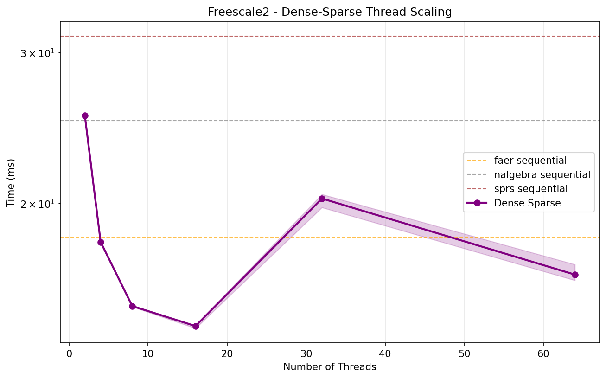
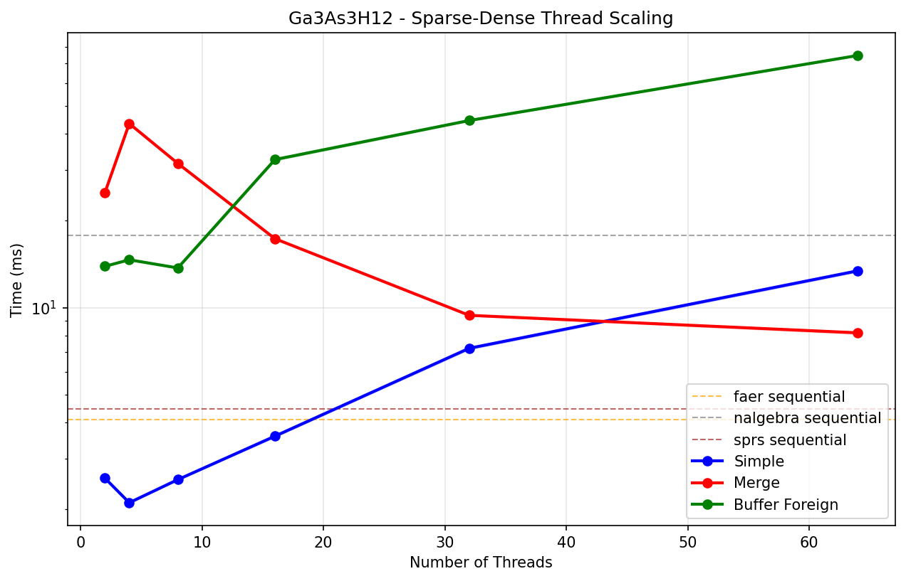
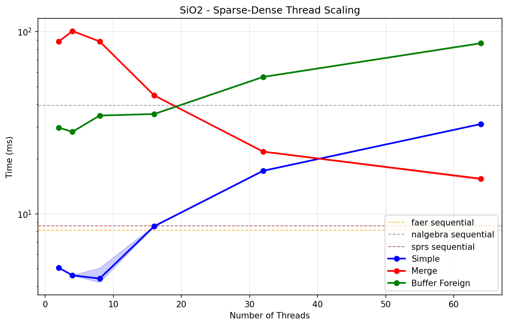
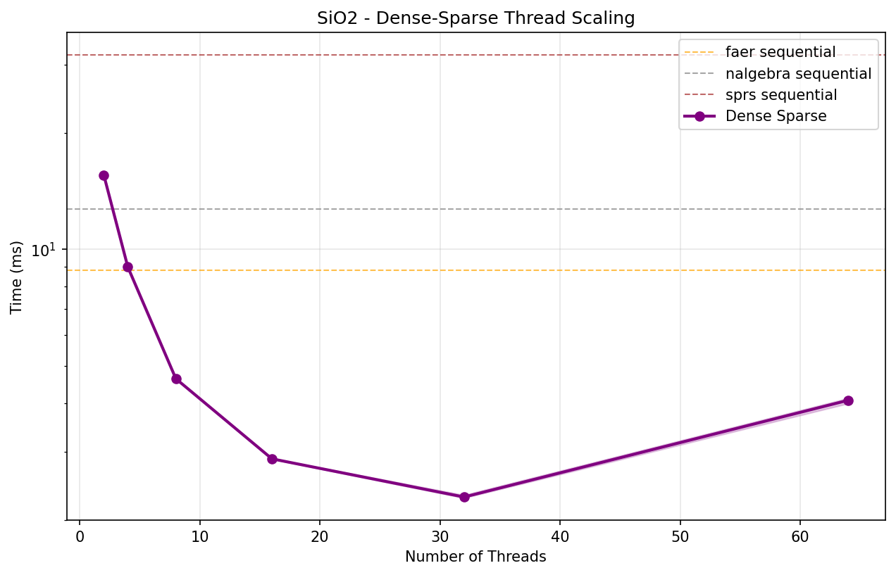
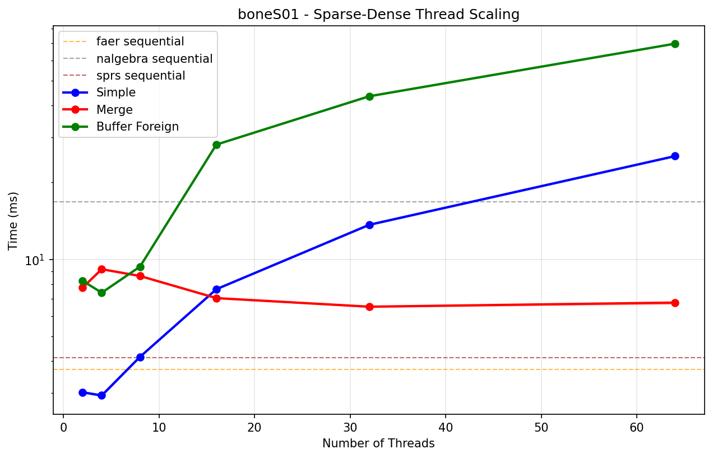
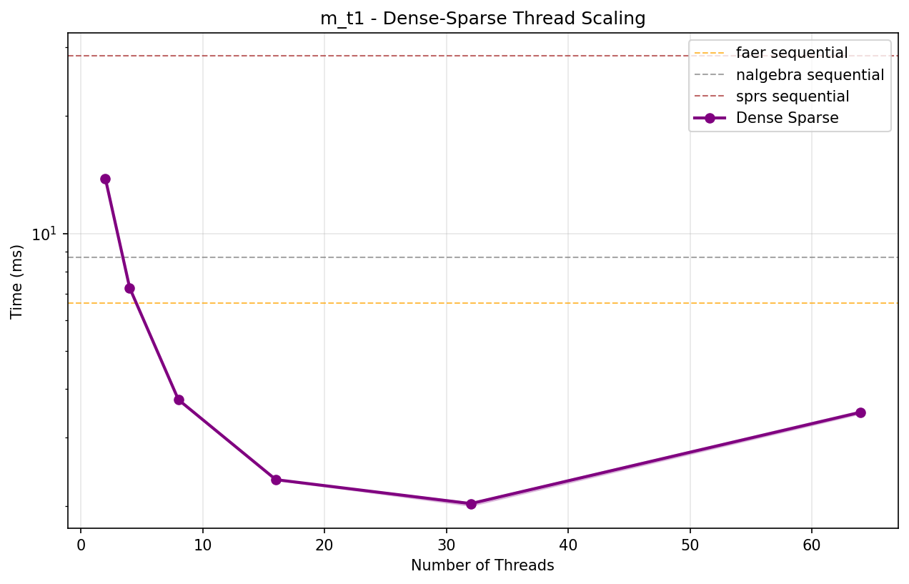
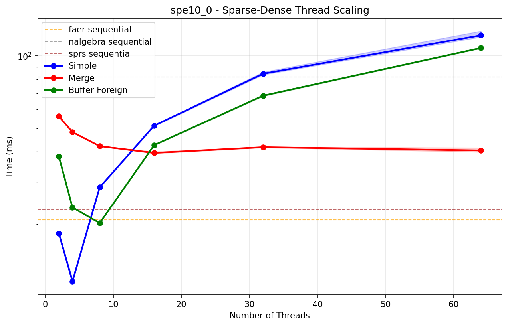

# Sequential Sparse-Dense Matrix-Vector Multiplication Benchmark Results

| Matrix | Dimensions | Non-zeros | faer | nalgebra | sprs |
|--------|------------|-----------|------|----------|------|
| **0** | 18x18 | 18 | 35.15 ns ± 0.05 ns | 103.42 ns ± 0.21 ns | 83.67 ns ± 0.08 ns |
| **1** | 51x51 | 79 | 102.77 ns ± 0.17 ns | 348.12 ns ± 0.71 ns | 224.25 ns ± 0.28 ns |
| **2** | 165x165 | 469 | 602.15 ns ± 0.39 ns | 1.72 µs ± 0.85 ns | 847.47 ns ± 0.97 ns |
| **3** | 585x585 | 2,209 | 1.58 µs ± 0.95 ns | 7.45 µs ± 4.67 ns | 3.51 µs ± 5.66 ns |
| **4** | 2193x2193 | 9,529 | 6.82 µs ± 3.40 ns | 31.15 µs ± 19.64 ns | 14.71 µs ± 23.14 ns |
| **synthetic** | 1000x1000 | 10,000 | 6.13 µs ± 2.08 ns | 29.99 µs ± 20.90 ns | 9.98 µs ± 7.13 ns |
| **5** | 8481x8481 | 39,529 | 28.94 µs ± 15.58 ns | 132.16 µs ± 107.11 ns | 53.62 µs ± 55.55 ns |
| **6** | 33345x33345 | 160,969 | 127.15 µs ± 101.38 ns | 562.15 µs ± 419.20 ns | 228.40 µs ± 306.59 ns |
| **7** | 132225x132225 | 649,609 | 537.21 µs ± 569.07 ns | 2.29 ms ± 2.06 µs | 937.90 µs ± 1.29 µs |
| **anisotropy** | 84315x84315 | 1,373,557 | 1.08 ms ± 14.81 µs | 4.53 ms ± 3.02 µs | 1.34 ms ± 1.91 µs |
| **boneS01** | 127224x127224 | 5,516,602 | 4.13 ms ± 4.92 µs | 16.54 ms ± 11.50 µs | 4.77 ms ± 4.09 µs |
| **Ga3As3H12** | 61349x61349 | 5,970,947 | 4.36 ms ± 5.24 µs | 17.87 ms ± 17.17 µs | 4.96 ms ± 9.05 µs |
| **rajat30** | 643994x643994 | 6,175,244 | 5.86 ms ± 18.29 µs | 20.09 ms ± 31.17 µs | 7.58 ms ± 10.28 µs |
| **m** | 97578x97578 | 9,753,570 | 7.26 ms ± 3.86 µs | 28.92 ms ± 7.01 µs | 7.85 ms ± 8.79 µs |
| **SiO2** | 155331x155331 | 11,283,503 | 8.86 ms ± 12.32 µs | 33.96 ms ± 23.12 µs | 9.54 ms ± 4.49 µs |
| **pwtk** | 217918x217918 | 11,524,432 | 8.62 ms ± 8.21 µs | 34.11 ms ± 24.15 µs | 9.78 ms ± 9.52 µs |
| **kkt** | 2063494x2063494 | 12,771,361 | 16.22 ms ± 19.94 µs | 48.98 ms ± 88.70 µs | 21.27 ms ± 35.03 µs |
| **crankseg** | 63838x63838 | 14,148,858 | 10.78 ms ± 16.53 µs | 41.40 ms ± 17.07 µs | 10.85 ms ± 8.69 µs |
| **Freescale2** | 2999349x2999349 | 14,313,235 | 19.31 ms ± 67.28 µs | 56.49 ms ± 120.34 µs | 28.39 ms ± 354.61 µs |
| **spe10** | 1159366x1159366 | 28,730,252 | 23.13 ms ± 59.02 µs | 92.01 ms ± 77.42 µs | 25.80 ms ± 46.18 µs |
# Sequential Dense-Sparse Matrix-Vector Multiplication Benchmark Results

| Matrix | Dimensions | Non-zeros | faer | nalgebra | sprs |
|--------|------------|-----------|------|----------|------|
| **0** | 18x18 | 18 | 35.90 ns ± 0.03 ns | 70.46 ns ± 0.06 ns | 81.31 ns ± 0.12 ns |
| **1** | 51x51 | 79 | 88.83 ns ± 0.12 ns | 181.20 ns ± 1.26 ns | 238.81 ns ± 0.24 ns |
| **2** | 165x165 | 469 | 345.70 ns ± 0.28 ns | 651.13 ns ± 0.47 ns | 886.99 ns ± 1.12 ns |
| **3** | 585x585 | 2,209 | 1.52 µs ± 0.96 ns | 2.63 µs ± 27.83 ns | 3.67 µs ± 4.72 ns |
| **4** | 2193x2193 | 9,529 | 6.20 µs ± 6.70 ns | 10.62 µs ± 11.66 ns | 15.28 µs ± 20.47 ns |
| **synthetic** | 1000x1000 | 10,000 | 5.51 µs ± 1.90 ns | 7.39 µs ± 2.93 ns | 11.41 µs ± 10.35 ns |
| **5** | 8481x8481 | 39,529 | 25.98 µs ± 510.64 ns | 42.60 µs ± 91.24 ns | 57.21 µs ± 53.32 ns |
| **6** | 33345x33345 | 160,969 | 120.92 µs ± 55.12 ns | 182.83 µs ± 222.18 ns | 243.44 µs ± 367.10 ns |
| **7** | 132225x132225 | 649,609 | 516.94 µs ± 468.54 ns | 780.59 µs ± 3.77 µs | 986.73 µs ± 1.72 µs |
| **boneS01** | 127224x127224 | 2,238,384 | 1.82 ms ± 5.28 µs | 2.40 ms ± 3.57 µs | 2.99 ms ± 3.03 µs |
| **Ga3As3H12** | 61349x61349 | 5,970,947 | 5.28 ms ± 4.20 µs | 5.74 ms ± 3.71 µs | 10.80 ms ± 4.78 µs |
| **rajat30** | 643994x643994 | 6,175,244 | 6.63 ms ± 5.12 µs | 7.61 ms ± 17.15 µs | 9.64 ms ± 11.48 µs |
| **m** | 97578x97578 | 9,753,570 | 8.25 ms ± 8.92 µs | 9.09 ms ± 6.53 µs | 16.07 ms ± 8.25 µs |
| **SiO2** | 155331x155331 | 11,283,503 | 9.97 ms ± 20.70 µs | 11.02 ms ± 9.34 µs | 19.54 ms ± 7.31 µs |
| **pwtk** | 217918x217918 | 11,524,432 | 9.29 ms ± 15.30 µs | 10.96 ms ± 16.07 µs | 16.51 ms ± 12.13 µs |
| **anisotropy** | 1313281x1313281 | 11,763,231 | 12.81 ms ± 26.04 µs | 12.59 ms ± 43.21 µs | 15.91 ms ± 48.88 µs |
| **kkt** | 2063494x2063494 | 12,771,361 | 18.40 ms ± 44.90 µs | 21.91 ms ± 55.50 µs | 22.72 ms ± 41.92 µs |
| **crankseg** | 63838x63838 | 14,148,858 | 12.92 ms ± 18.69 µs | 13.62 ms ± 13.75 µs | 26.55 ms ± 15.20 µs |
| **Freescale2** | 2999349x2999349 | 14,313,235 | 23.81 ms ± 339.93 µs | 24.06 ms ± 28.59 µs | 29.13 ms ± 75.09 µs |
| **spe10** | 1159366x1159366 | 28,730,252 | 23.25 ms ± 45.01 µs | 26.25 ms ± 51.30 µs | 38.83 ms ± 47.81 µs |

# Parallel Thread Scaling Results - Sparse-Dense Multiplication (Simple)

| Matrix | Dimensions | Non-zeros | 2 Threads | 4 Threads | 8 Threads | 16 Threads |
|--------|------------|-----------|-----------:|-----------:|-----------:|-----------:|
| **boneS01_M** | 127224x127224 | 1,182,804 | 1.430 ms | 727.07 µs | 887.79 µs | 1.546 ms |
| **anisotropy_3d_1r** | 84315x84315 | 1,394,367 | 1.374 ms | 720.36 µs | 982.57 µs | 1.238 ms |
| **Ga3As3H12** | 61349x61349 | 3,016,148 | 1.980 ms | 1.466 ms | 1.351 ms | 1.598 ms |
| **boneS01** | 127224x127224 | 3,421,188 | 2.603 ms | 1.811 ms | 1.729 ms | 2.867 ms |
| **m_t1** | 97578x97578 | 4,925,574 | 3.095 ms | 2.180 ms | 2.135 ms | 2.781 ms |
| **SiO2** | 155331x155331 | 5,719,417 | 3.496 ms | 3.127 ms | 3.010 ms | 3.721 ms |
| **pwtk** | 217918x217918 | 5,926,171 | 4.090 ms | 3.016 ms | 3.150 ms | 4.164 ms |
| **rajat30** | 643994x643994 | 6,175,377 | 5.950 ms | 5.038 ms | 5.969 ms | 8.738 ms |
| **crankseg_2** | 63838x63838 | 7,106,348 | 4.012 ms | 2.952 ms | 2.827 ms | 3.395 ms |
| **kkt_power** | 2063494x2063494 | 8,130,343 | 10.887 ms | 10.250 ms | 13.643 ms | 21.570 ms |
| **anisotropy_3d_2r** | 650621x650621 | 10,978,101 | 7.841 ms | 7.582 ms | 8.733 ms | 11.791 ms |
| **anisotropy_2d** | 1313281x1313281 | 11,804,161 | 10.645 ms | 10.801 ms | 14.792 ms | 19.000 ms |
| **Freescale2** | 2999349x2999349 | 23,042,677 | 24.722 ms | 20.126 ms | 24.065 ms | 36.452 ms |
| **spe10_0** | 1159366x1159366 | 30,628,096 | 18.914 ms | 15.702 ms | 17.693 ms | 22.685 ms |

# Parallel Thread Scaling Results - Sparse-Dense Multiplication (Merge)

| Matrix | Dimensions | Non-zeros | 2 Threads | 4 Threads | 8 Threads | 16 Threads |
|--------|------------|-----------|-----------:|-----------:|-----------:|-----------:|
| **boneS01_M** | 127224x127224 | 1,182,804 | 64.847 ms | 29.298 ms | 15.170 ms | 8.564 ms |
| **anisotropy_3d_1r** | 84315x84315 | 1,394,367 | 72.154 ms | 32.556 ms | 16.693 ms | 8.839 ms |
| **Ga3As3H12** | 61349x61349 | 3,016,148 | 147.824 ms | 71.229 ms | 37.476 ms | 18.787 ms |
| **boneS01** | 127224x127224 | 3,421,188 | 148.825 ms | 67.908 ms | 35.654 ms | 18.590 ms |
| **m_t1** | 97578x97578 | 4,925,574 | 218.485 ms | 101.019 ms | 51.713 ms | 27.337 ms |
| **SiO2** | 155331x155331 | 5,719,417 | 295.750 ms | 145.474 ms | 83.261 ms | 41.944 ms |
| **pwtk** | 217918x217918 | 5,926,171 | 264.731 ms | 124.188 ms | 64.146 ms | 34.457 ms |
| **rajat30** | 643994x643994 | 6,175,377 | 407.327 ms | 204.664 ms | 104.987 ms | 55.742 ms |
| **crankseg_2** | 63838x63838 | 7,106,348 | 351.581 ms | 166.677 ms | 83.768 ms | 42.932 ms |
| **kkt_power** | 2063494x2063494 | 8,130,343 | 789.880 ms | 396.941 ms | 210.260 ms | 118.527 ms |
| **anisotropy_3d_2r** | 650621x650621 | 10,978,101 | 824.924 ms | 420.293 ms | 229.747 ms | 117.929 ms |
| **anisotropy_2d** | 1313281x1313281 | 11,804,161 | 784.362 ms | 367.744 ms | 211.295 ms | 123.914 ms |
| **Freescale2** | 2999349x2999349 | 23,042,677 | 1901.569 ms | 980.261 ms | 534.459 ms | 321.458 ms |
| **spe10_0** | 1159366x1159366 | 30,628,096 | 1785.758 ms | 830.917 ms | 441.468 ms | 253.083 ms |

# Parallel Thread Scaling Results - Sparse-Dense Multiplication (Buffer_Foreign)

| Matrix | Dimensions | Non-zeros | 2 Threads | 4 Threads | 8 Threads | 16 Threads |
|--------|------------|-----------|-----------:|-----------:|-----------:|-----------:|
| **boneS01_M** | 127224x127224 | 1,182,804 | 5.348 ms | 3.800 ms | 4.436 ms | 8.329 ms |
| **anisotropy_3d_1r** | 84315x84315 | 1,394,367 | 5.993 ms | 5.480 ms | 5.873 ms | 9.008 ms |
| **Ga3As3H12** | 61349x61349 | 3,016,148 | 8.924 ms | 6.849 ms | 10.373 ms | 13.816 ms |
| **boneS01** | 127224x127224 | 3,421,188 | 10.001 ms | 6.329 ms | 5.862 ms | 11.477 ms |
| **m_t1** | 97578x97578 | 4,925,574 | 14.489 ms | 11.545 ms | 10.820 ms | 15.448 ms |
| **SiO2** | 155331x155331 | 5,719,417 | 17.414 ms | 12.983 ms | 14.578 ms | 16.357 ms |
| **pwtk** | 217918x217918 | 5,926,171 | 19.504 ms | 13.446 ms | 12.019 ms | 13.272 ms |
| **rajat30** | 643994x643994 | 6,175,377 | 27.891 ms | 18.325 ms | 17.588 ms | 18.394 ms |
| **crankseg_2** | 63838x63838 | 7,106,348 | 24.917 ms | 18.340 ms | 17.851 ms | 21.369 ms |
| **kkt_power** | 2063494x2063494 | 8,130,343 | 64.709 ms | 44.609 ms | 28.607 ms | 26.866 ms |
| **anisotropy_3d_2r** | 650621x650621 | 10,978,101 | 46.938 ms | 29.569 ms | 20.987 ms | 23.662 ms |
| **anisotropy_2d** | 1313281x1313281 | 11,804,161 | 54.823 ms | 33.539 ms | 23.206 ms | 25.973 ms |
| **Freescale2** | 2999349x2999349 | 23,042,677 | 120.767 ms | 69.298 ms | 43.843 ms | 44.060 ms |
| **spe10_0** | 1159366x1159366 | 30,628,096 | 81.889 ms | 43.637 ms | 27.792 ms | 32.536 ms |

# Parallel Thread Scaling Results - Dense-Sparse Multiplication (Dense_Sparse)

| Matrix | Dimensions | Non-zeros | 2 Threads | 4 Threads | 8 Threads | 16 Threads |
|--------|------------|-----------|-----------:|-----------:|-----------:|-----------:|
| **boneS01_M** | 127224x127224 | 1,182,804 | 2.504 ms | 827.16 µs | 657.95 µs | 678.81 µs |
| **anisotropy_3d_1r** | 84315x84315 | 1,394,367 | 2.258 ms | 816.78 µs | 556.38 µs | 1.255 ms |
| **Ga3As3H12** | 61349x61349 | 3,016,148 | 3.186 ms | 1.865 ms | 1.355 ms | 1.439 ms |
| **boneS01** | 127224x127224 | 3,421,188 | 3.028 ms | 1.915 ms | 1.594 ms | 1.589 ms |
| **m_t1** | 97578x97578 | 4,925,574 | 4.387 ms | 2.756 ms | 2.083 ms | 2.108 ms |
| **SiO2** | 155331x155331 | 5,719,417 | 5.496 ms | 4.011 ms | 2.894 ms | 3.170 ms |
| **pwtk** | 217918x217918 | 5,926,171 | 5.303 ms | 3.542 ms | 3.181 ms | 3.219 ms |
| **rajat30** | 643994x643994 | 6,175,377 | 8.568 ms | 7.261 ms | 7.106 ms | 8.207 ms |
| **crankseg_2** | 63838x63838 | 7,106,348 | 7.395 ms | 4.470 ms | 2.872 ms | 2.845 ms |
| **kkt_power** | 2063494x2063494 | 8,130,343 | 19.117 ms | 17.858 ms | 17.968 ms | 18.177 ms |
| **anisotropy_3d_2r** | 650621x650621 | 10,978,101 | 11.555 ms | 9.321 ms | 9.030 ms | 9.355 ms |
| **anisotropy_2d** | 1313281x1313281 | 11,804,161 | 15.698 ms | 14.958 ms | 14.863 ms | 15.258 ms |
| **Freescale2** | 2999349x2999349 | 23,042,677 | 40.724 ms | 35.390 ms | 36.714 ms | 37.811 ms |
| **spe10_0** | 1159366x1159366 | 30,628,096 | 27.306 ms | 20.897 ms | 20.311 ms | 21.348 ms |

## Thread Scaling Plots

### Freescale2 (2999349x2999349, 14,313,235 nnz, 0.000% dense)

<table><tr>
<td></td>
<td></td>
</tr></table>

### Ga3As3H12 (61349x61349, 5,970,947 nnz, 0.159% dense)

<table><tr>
<td></td>
<td></td>
</tr></table>

### SiO2 (155331x155331, 5,719,417 nnz, 0.024% dense)

<table><tr>
<td></td>
<td></td>
</tr></table>

### anisotropy_2d (1313281x1313281, 11,804,161 nnz, 0.001% dense)

<table><tr>
<td></td>
<td></td>
</tr></table>

### anisotropy_3d_1r (84315x84315, 1,394,367 nnz, 0.020% dense)

<table><tr>
<td></td>
<td></td>
</tr></table>

### anisotropy_3d_2r (650621x650621, 10,978,101 nnz, 0.003% dense)

<table><tr>
<td></td>
<td></td>
</tr></table>

### boneS01 (127224x127224, 2,238,384 nnz, 0.014% dense)

<table><tr>
<td></td>
<td></td>
</tr></table>

### boneS01_M (127224x127224, 1,182,804 nnz, 0.007% dense)

<table><tr>
<td></td>
<td></td>
</tr></table>

### crankseg_2 (63838x63838, 7,106,348 nnz, 0.174% dense)

<table><tr>
<td></td>
<td></td>
</tr></table>

### kkt_power (2063494x2063494, 8,130,343 nnz, 0.000% dense)

<table><tr>
<td></td>
<td></td>
</tr></table>

### m_t1 (97578x97578, 4,925,574 nnz, 0.052% dense)

<table><tr>
<td></td>
<td></td>
</tr></table>

### pwtk (217918x217918, 11,524,432 nnz, 0.024% dense)

<table><tr>
<td></td>
<td></td>
</tr></table>

### rajat30 (643994x643994, 6,175,244 nnz, 0.001% dense)

<table><tr>
<td></td>
<td></td>
</tr></table>

### spe10_0 (1159366x1159366, 30,628,096 nnz, 0.002% dense)

<table><tr>
<td></td>
<td></td>
</tr></table>

## Notes

- Times shown are median ± approximate standard deviation from Criterion benchmarks
- `faer` = faer built-in sequential sparse-dense matrix-vector multiplication
- `nalgebra` = nalgebra-sparse CSC matrix-vector multiplication
- `sprs` = sprs CSC matrix-vector multiplication
- `simple`, `merge`, `buffer_foreign` = different parallel sparse-dense algorithms
- `dense_sparse` = parallel dense-sparse matrix-vector multiplication implementation
- Thread scaling shows parallel implementation performance across different thread counts
- All measurements taken on the same system with consistent methodology
- Plots show thread scaling with 95% confidence intervals and sequential baselines

## System Information

```
Architecture:                            x86_64
CPU op-mode(s):                          32-bit, 64-bit
Address sizes:                           39 bits physical, 48 bits virtual
Byte Order:                              Little Endian
CPU(s):                                  16
On-line CPU(s) list:                     0-15
Vendor ID:                               GenuineIntel
Model name:                              11th Gen Intel(R) Core(TM) i7-11800H @ 2.30GHz
CPU family:                              6
Model:                                   141
Thread(s) per core:                      2
Core(s) per socket:                      8
Socket(s):                               1
Stepping:                                1
CPU(s) scaling MHz:                      52%
CPU max MHz:                             4600.0000
CPU min MHz:                             800.0000
BogoMIPS:                                4608.00
Flags:                                   fpu vme de pse tsc msr pae mce cx8 apic sep mtrr pge mca cmov pat pse36 clflush dts acpi mmx fxsr sse sse2 ss ht tm pbe syscall nx pdpe1gb rdtscp lm constant_tsc art arch_perfmon pebs bts rep_good nopl xtopology nonstop_tsc cpuid aperfmperf tsc_known_freq pni pclmulqdq dtes64 monitor ds_cpl vmx est tm2 ssse3 sdbg fma cx16 xtpr pdcm pcid sse4_1 sse4_2 x2apic movbe popcnt tsc_deadline_timer aes xsave avx f16c rdrand lahf_lm abm 3dnowprefetch cpuid_fault epb cat_l2 cdp_l2 ssbd ibrs ibpb stibp ibrs_enhanced tpr_shadow flexpriority ept vpid ept_ad fsgsbase tsc_adjust bmi1 avx2 smep bmi2 erms invpcid rdt_a avx512f avx512dq rdseed adx smap avx512ifma clflushopt clwb intel_pt avx512cd sha_ni avx512bw avx512vl xsaveopt xsavec xgetbv1 xsaves split_lock_detect user_shstk dtherm ida arat pln pts hwp hwp_notify hwp_act_window hwp_epp hwp_pkg_req vnmi avx512vbmi umip pku ospke avx512_vbmi2 gfni vaes vpclmulqdq avx512_vnni avx512_bitalg avx512_vpopcntdq rdpid movdiri movdir64b fsrm avx512_vp2intersect md_clear ibt flush_l1d arch_capabilities
Virtualization:                          VT-x
L1d cache:                               384 KiB (8 instances)
L1i cache:                               256 KiB (8 instances)
L2 cache:                                10 MiB (8 instances)
L3 cache:                                24 MiB (1 instance)
NUMA node(s):                            1
NUMA node0 CPU(s):                       0-15
Vulnerability Gather data sampling:      Vulnerable: No microcode
Vulnerability Ghostwrite:                Not affected
Vulnerability Indirect target selection: Mitigation; Aligned branch/return thunks
Vulnerability Itlb multihit:             Not affected
Vulnerability L1tf:                      Not affected
Vulnerability Mds:                       Not affected
Vulnerability Meltdown:                  Not affected
Vulnerability Mmio stale data:           Not affected
Vulnerability Reg file data sampling:    Not affected
Vulnerability Retbleed:                  Not affected
Vulnerability Spec rstack overflow:      Not affected
Vulnerability Spec store bypass:         Mitigation; Speculative Store Bypass disabled via prctl
Vulnerability Spectre v1:                Mitigation; usercopy/swapgs barriers and __user pointer sanitization
Vulnerability Spectre v2:                Mitigation; Enhanced / Automatic IBRS; IBPB conditional; PBRSB-eIBRS SW sequence; BHI SW loop, KVM SW loop
Vulnerability Srbds:                     Not affected
Vulnerability Tsx async abort:           Not affected
```