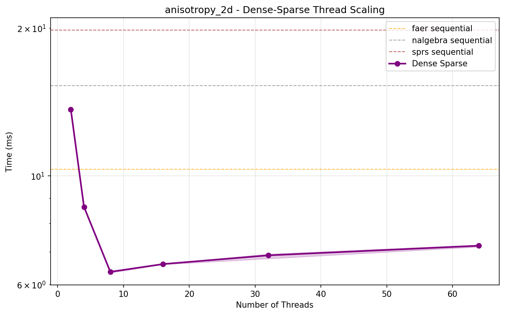
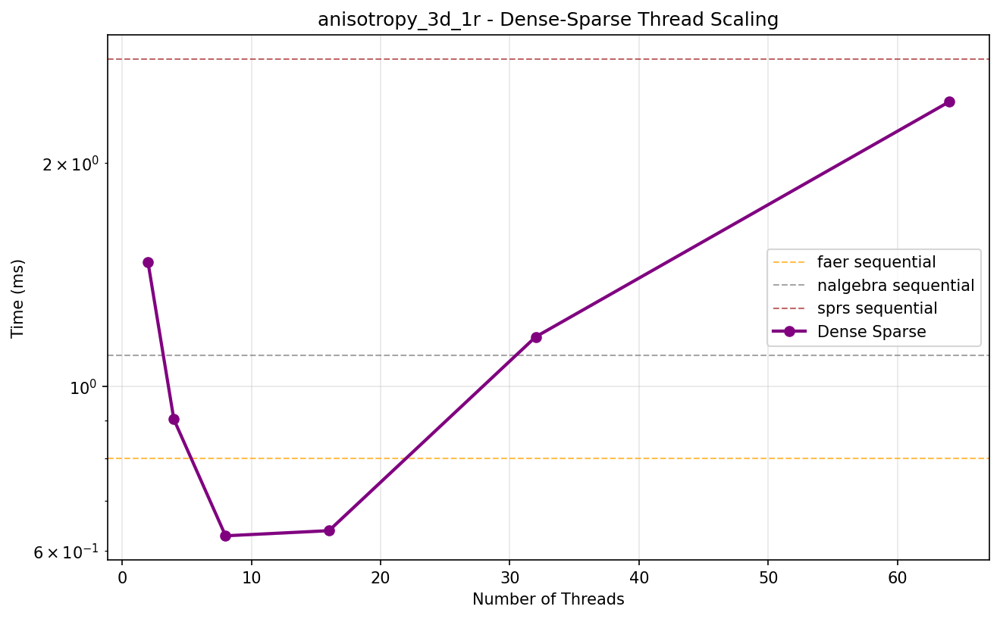
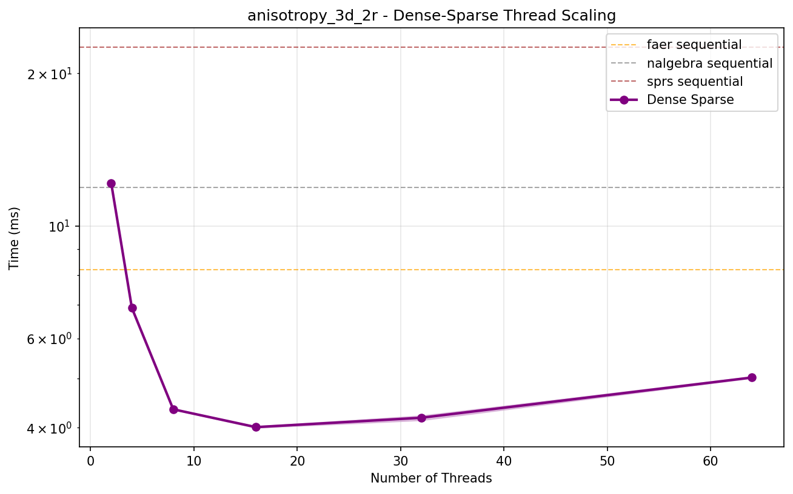
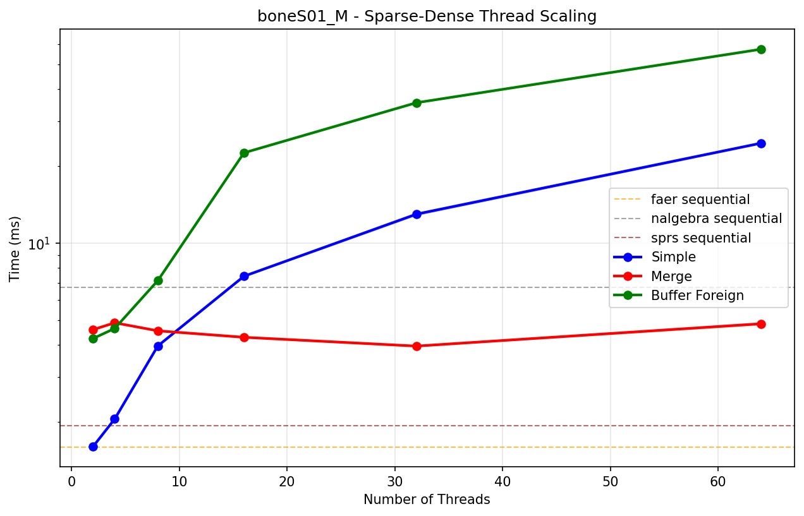
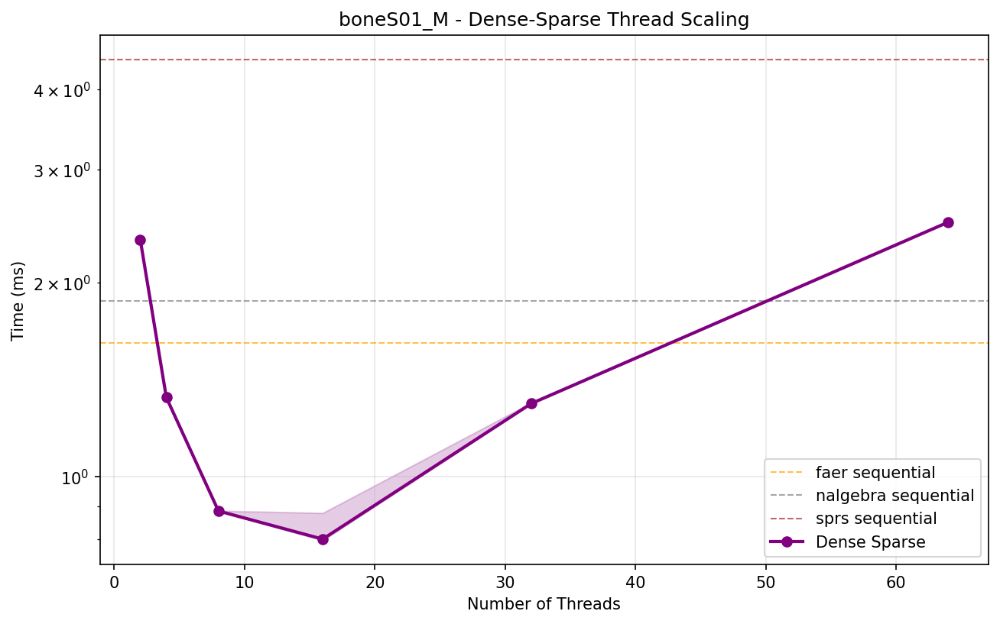
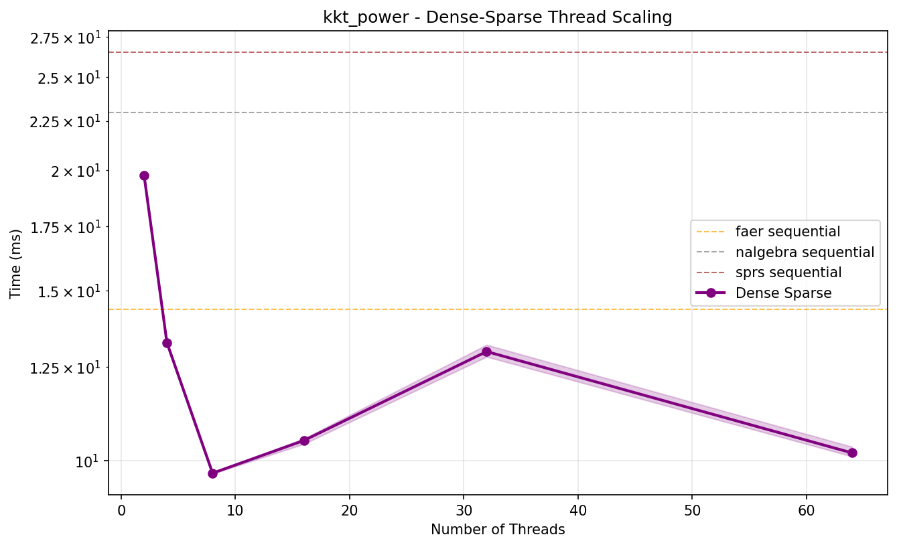
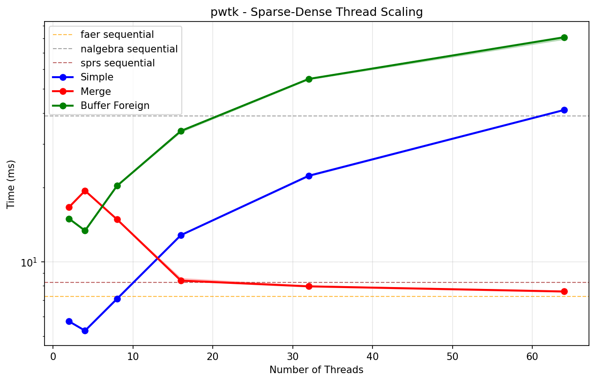

# Sequential Sparse-Dense Matrix-Vector Multiplication Benchmark Results

| Matrix | Dimensions | Non-zeros | faer | nalgebra | sprs |
|--------|------------|-----------|------|----------|------|
| **0** | 18x18 | 18 | **33.70 ns ± 0.03 ns** | 190.76 ns ± 0.08 ns | 78.70 ns ± 0.01 ns |
| **1** | 51x51 | 79 | **92.47 ns ± 0.07 ns** | 344.03 ns ± 0.04 ns | 221.29 ns ± 0.03 ns |
| **2** | 165x165 | 469 | **403.20 ns ± 0.09 ns** | 1.67 µs ± 0.12 ns | 850.40 ns ± 0.06 ns |
| **3** | 585x585 | 2,209 | **1.79 µs ± 0.07 ns** | 7.36 µs ± 0.47 ns | 3.28 µs ± 0.23 ns |
| **4** | 2193x2193 | 9,529 | **7.58 µs ± 0.25 ns** | 30.95 µs ± 1.44 ns | 13.03 µs ± 0.51 ns |
| **synthetic** | 1000x1000 | 10,000 | **6.36 µs ± 3.78 ns** | 29.36 µs ± 1.27 ns | 9.69 µs ± 0.73 ns |
| **5** | 8481x8481 | 39,529 | **31.51 µs ± 1.66 ns** | 127.75 µs ± 5.52 ns | 53.45 µs ± 1.20 ns |
| **6** | 33345x33345 | 160,969 | **131.00 µs ± 4.72 ns** | 519.94 µs ± 8.93 ns | 214.18 µs ± 23.37 ns |
| **7** | 132225x132225 | 649,609 | **530.21 µs ± 39.10 ns** | 2.10 ms ± 142.28 ns | 864.20 µs ± 78.05 ns |
| **anisotropy_3d_1r** | 84315x84315 | 1,373,557 | **945.65 µs ± 143.15 ns** | 4.14 ms ± 297.77 ns | 1.21 ms ± 94.61 ns |
| **boneS01_M** | 127224x127224 | 2,238,384 | **1.60 ms ± 161.40 ns** | 6.72 ms ± 735.16 ns | 1.94 ms ± 166.75 ns |
| **boneS01** | 127224x127224 | 5,516,602 | **3.72 ms ± 474.29 ns** | 16.77 ms ± 2.51 µs | 4.13 ms ± 619.19 ns |
| **Ga3As3H12** | 61349x61349 | 5,970,947 | **4.11 ms ± 316.34 ns** | 17.82 ms ± 7.44 µs | 4.45 ms ± 417.92 ns |
| **rajat30** | 643994x643994 | 6,175,244 | **5.75 ms ± 2.36 µs** | 21.66 ms ± 8.00 µs | 7.30 ms ± 1.14 µs |
| **m_t1** | 97578x97578 | 9,753,570 | **6.24 ms ± 485.86 ns** | 34.95 ms ± 4.56 µs | 6.84 ms ± 896.34 ns |
| **anisotropy_3d_2r** | 650621x650621 | 10,895,827 | **8.69 ms ± 7.96 µs** | 39.87 ms ± 12.17 µs | 10.30 ms ± 11.64 µs |
| **SiO2** | 155331x155331 | 11,283,503 | **8.11 ms ± 635.21 ns** | 39.48 ms ± 3.57 µs | 8.58 ms ± 531.90 ns |
| **pwtk** | 217918x217918 | 11,524,432 | **7.23 ms ± 772.02 ns** | 38.96 ms ± 4.15 µs | 8.26 ms ± 814.23 ns |
| **anisotropy_2d** | 1313281x1313281 | 11,763,231 | **10.21 ms ± 11.33 µs** | 45.42 ms ± 13.14 µs | 14.64 ms ± 20.04 µs |
| **kkt_power** | 2063494x2063494 | 12,771,361 | **14.14 ms ± 13.18 µs** | 53.74 ms ± 28.13 µs | 20.37 ms ± 21.73 µs |
| **crankseg_2** | 63838x63838 | 14,148,858 | **9.09 ms ± 926.58 ns** | 48.64 ms ± 8.40 µs | 9.86 ms ± 637.58 ns |
| **Freescale2** | 2999349x2999349 | 14,313,235 | **17.42 ms ± 6.79 µs** | 63.55 ms ± 41.54 µs | 27.51 ms ± 12.38 µs |
| **spe10_0** | 1159366x1159366 | 28,730,252 | **20.84 ms ± 1.69 µs** | 81.85 ms ± 2.91 µs | 23.02 ms ± 1.10 µs |
# Sequential Dense-Sparse Matrix-Vector Multiplication Benchmark Results

| Matrix | Dimensions | Non-zeros | faer | nalgebra | sprs |
|--------|------------|-----------|------|----------|------|
| **0** | 18x18 | 18 | **31.33 ns ± 0.03 ns** | 67.77 ns ± 0.01 ns | 82.10 ns ± 0.01 ns |
| **1** | 51x51 | 79 | **87.35 ns ± 0.02 ns** | 169.79 ns ± 0.01 ns | 225.55 ns ± 0.03 ns |
| **2** | 165x165 | 469 | **336.03 ns ± 0.03 ns** | 628.49 ns ± 0.06 ns | 868.86 ns ± 0.11 ns |
| **3** | 585x585 | 2,209 | **1.66 µs ± 0.05 ns** | 2.42 µs ± 0.13 ns | 3.43 µs ± 0.22 ns |
| **4** | 2193x2193 | 9,529 | **6.86 µs ± 0.19 ns** | 9.52 µs ± 0.62 ns | 13.76 µs ± 4.28 ns |
| **synthetic** | 1000x1000 | 10,000 | **5.45 µs ± 1.64 ns** | 7.14 µs ± 0.68 ns | 16.58 µs ± 0.69 ns |
| **5** | 8481x8481 | 39,529 | **29.50 µs ± 2.00 ns** | 38.72 µs ± 4.29 ns | 56.08 µs ± 7.65 ns |
| **6** | 33345x33345 | 160,969 | **121.94 µs ± 4.97 ns** | 160.80 µs ± 5.07 ns | 225.19 µs ± 12.53 ns |
| **7** | 132225x132225 | 649,609 | **487.19 µs ± 27.17 ns** | 655.29 µs ± 50.51 ns | 903.06 µs ± 69.36 ns |
| **anisotropy_3d_1r** | 84315x84315 | 1,373,557 | **798.70 µs ± 72.81 ns** | 1.10 ms ± 110.46 ns | 2.76 ms ± 429.06 ns |
| **boneS01_M** | 127224x127224 | 2,238,384 | **1.62 ms ± 288.75 ns** | 1.87 ms ± 108.43 ns | 4.45 ms ± 177.96 ns |
| **boneS01** | 127224x127224 | 5,516,602 | **3.88 ms ± 351.48 ns** | 4.72 ms ± 606.92 ns | 13.86 ms ± 384.44 ns |
| **Ga3As3H12** | 61349x61349 | 5,970,947 | **4.74 ms ± 569.02 ns** | 5.41 ms ± 854.78 ns | 17.50 ms ± 289.58 ns |
| **rajat30** | 643994x643994 | 6,175,244 | **5.64 ms ± 3.87 µs** | 7.43 ms ± 2.64 µs | 12.67 ms ± 2.53 µs |
| **m_t1** | 97578x97578 | 9,753,570 | **6.63 ms ± 786.48 ns** | 8.68 ms ± 1.87 µs | 28.57 ms ± 554.50 ns |
| **anisotropy_3d_2r** | 650621x650621 | 10,895,827 | **8.20 ms ± 4.85 µs** | 11.92 ms ± 6.72 µs | 22.53 ms ± 7.64 µs |
| **SiO2** | 155331x155331 | 11,283,503 | **8.84 ms ± 645.14 ns** | 12.69 ms ± 2.64 µs | 31.82 ms ± 773.62 ns |
| **pwtk** | 217918x217918 | 11,524,432 | **7.86 ms ± 1.61 µs** | 10.15 ms ± 2.75 µs | 30.38 ms ± 660.94 ns |
| **anisotropy_2d** | 1313281x1313281 | 11,763,231 | **10.31 ms ± 7.81 µs** | 15.28 ms ± 8.64 µs | 19.84 ms ± 4.26 µs |
| **kkt_power** | 2063494x2063494 | 12,771,361 | **14.35 ms ± 14.37 µs** | 22.95 ms ± 19.53 µs | 26.53 ms ± 13.71 µs |
| **crankseg_2** | 63838x63838 | 14,148,858 | **10.70 ms ± 1.36 µs** | 12.89 ms ± 3.83 µs | 44.07 ms ± 738.62 ns |
| **Freescale2** | 2999349x2999349 | 14,313,235 | **18.23 ms ± 10.00 µs** | 24.97 ms ± 8.90 µs | 31.35 ms ± 11.60 µs |
| **spe10_0** | 1159366x1159366 | 28,730,252 | **20.22 ms ± 1.55 µs** | 23.42 ms ± 3.48 µs | 60.35 ms ± 1.36 µs |

# Parallel Thread Scaling Results - Sparse-Dense Multiplication (`simple`)

| Matrix | Dimensions | Non-zeros | 2 Threads | 4 Threads | 8 Threads | 16 Threads | 32 Threads | 64 Threads |
|--------|------------|-----------|-----------:|-----------:|-----------:|-----------:|-----------:|-----------:|
| **anisotropy_3d_1r** | 84315x84315 | 1,373,557 | **1.371 ms** | 1.711 ms | 2.723 ms | 5.210 ms | 9.004 ms | 17.376 ms |
| **boneS01_M** | 127224x127224 | 2,238,384 | **1.609 ms** | 2.059 ms | 3.970 ms | 7.432 ms | 12.982 ms | 24.586 ms |
| **boneS01** | 127224x127224 | 5,516,602 | 3.023 ms | **2.938 ms** | 4.157 ms | 7.648 ms | 13.659 ms | 25.353 ms |
| **Ga3As3H12** | 61349x61349 | 5,970,947 | 2.565 ms | **2.111 ms** | 2.537 ms | 3.588 ms | 7.230 ms | 13.408 ms |
| **rajat30** | 643994x643994 | 6,175,244 | **8.553 ms** | 10.770 ms | 16.005 ms | 31.272 ms | 54.305 ms | 88.519 ms |
| **m_t1** | 97578x97578 | 9,753,570 | 3.755 ms | **2.467 ms** | 3.434 ms | 6.789 ms | 11.399 ms | 20.883 ms |
| **anisotropy_3d_2r** | 650621x650621 | 10,895,827 | **10.488 ms** | 11.696 ms | 16.169 ms | 29.390 ms | 54.747 ms | 94.094 ms |
| **SiO2** | 155331x155331 | 11,283,503 | 5.055 ms | 4.594 ms | **4.412 ms** | 8.550 ms | 17.226 ms | 31.117 ms |
| **pwtk** | 217918x217918 | 11,524,432 | 5.743 ms | **5.266 ms** | 7.084 ms | 12.819 ms | 22.281 ms | 41.135 ms |
| **anisotropy_2d** | 1313281x1313281 | 11,763,231 | 11.985 ms | **10.231 ms** | 27.359 ms | 50.681 ms | 82.101 ms | 118.357 ms |
| **kkt_power** | 2063494x2063494 | 12,771,361 | **22.546 ms** | 30.172 ms | 42.509 ms | 70.074 ms | 136.142 ms | 180.936 ms |
| **crankseg_2** | 63838x63838 | 14,148,858 | 5.445 ms | **3.470 ms** | 3.491 ms | 5.815 ms | 9.320 ms | 15.548 ms |
| **Freescale2** | 2999349x2999349 | 14,313,235 | **20.409 ms** | 29.752 ms | 52.805 ms | 85.933 ms | 119.066 ms | 138.199 ms |
| **spe10_0** | 1159366x1159366 | 28,730,252 | 18.349 ms | **11.596 ms** | 28.486 ms | 51.353 ms | 84.338 ms | 121.798 ms |

# Parallel Thread Scaling Results - Sparse-Dense Multiplication (`merge`)

| Matrix | Dimensions | Non-zeros | 2 Threads | 4 Threads | 8 Threads | 16 Threads | 32 Threads | 64 Threads |
|--------|------------|-----------|-----------:|-----------:|-----------:|-----------:|-----------:|-----------:|
| **anisotropy_3d_1r** | 84315x84315 | 1,373,557 | 19.368 ms | 16.180 ms | 11.952 ms | 6.803 ms | **4.085 ms** | 4.924 ms |
| **boneS01_M** | 127224x127224 | 2,238,384 | 4.598 ms | 4.889 ms | 4.548 ms | 4.291 ms | **3.965 ms** | 4.847 ms |
| **boneS01** | 127224x127224 | 5,516,602 | 7.760 ms | 9.157 ms | 8.613 ms | 7.057 ms | **6.532 ms** | 6.778 ms |
| **Ga3As3H12** | 61349x61349 | 5,970,947 | 25.047 ms | 43.372 ms | 31.562 ms | 17.320 ms | 9.402 ms | **8.179 ms** |
| **rajat30** | 643994x643994 | 6,175,244 | 72.305 ms | 70.996 ms | 58.045 ms | 34.475 ms | 17.760 ms | **10.933 ms** |
| **m_t1** | 97578x97578 | 9,753,570 | 17.942 ms | 20.738 ms | 21.015 ms | 17.075 ms | 10.123 ms | **7.836 ms** |
| **anisotropy_3d_2r** | 650621x650621 | 10,895,827 | 249.225 ms | 181.529 ms | 135.836 ms | 68.648 ms | 38.463 ms | **27.466 ms** |
| **SiO2** | 155331x155331 | 11,283,503 | 88.396 ms | 100.757 ms | 88.341 ms | 44.669 ms | 21.955 ms | **15.579 ms** |
| **pwtk** | 217918x217918 | 11,524,432 | 16.649 ms | 19.387 ms | 14.852 ms | 8.394 ms | 7.959 ms | **7.585 ms** |
| **anisotropy_2d** | 1313281x1313281 | 11,763,231 | 345.457 ms | 287.580 ms | 152.753 ms | 80.072 ms | 47.027 ms | **34.815 ms** |
| **kkt_power** | 2063494x2063494 | 12,771,361 | 643.982 ms | 318.796 ms | 196.604 ms | 107.975 ms | 64.851 ms | **46.116 ms** |
| **crankseg_2** | 63838x63838 | 14,148,858 | 173.627 ms | 151.011 ms | 80.460 ms | 40.940 ms | 20.271 ms | **14.430 ms** |
| **Freescale2** | 2999349x2999349 | 14,313,235 | 392.314 ms | 251.249 ms | 194.513 ms | 127.989 ms | 84.729 ms | **64.194 ms** |
| **spe10_0** | 1159366x1159366 | 28,730,252 | 56.162 ms | 48.265 ms | 42.193 ms | **39.562 ms** | 41.787 ms | 40.491 ms |

# Parallel Thread Scaling Results - Sparse-Dense Multiplication (`buffer_foreign`)

| Matrix | Dimensions | Non-zeros | 2 Threads | 4 Threads | 8 Threads | 16 Threads | 32 Threads | 64 Threads |
|--------|------------|-----------|-----------:|-----------:|-----------:|-----------:|-----------:|-----------:|
| **anisotropy_3d_1r** | 84315x84315 | 1,373,557 | **5.222 ms** | 8.527 ms | 12.167 ms | 19.195 ms | 30.618 ms | 52.687 ms |
| **boneS01_M** | 127224x127224 | 2,238,384 | **4.248 ms** | 4.647 ms | 7.146 ms | 22.542 ms | 35.359 ms | 57.210 ms |
| **boneS01** | 127224x127224 | 5,516,602 | 8.245 ms | **7.410 ms** | 9.370 ms | 28.130 ms | 43.472 ms | 69.782 ms |
| **Ga3As3H12** | 61349x61349 | 5,970,947 | 13.897 ms | 14.641 ms | **13.717 ms** | 32.556 ms | 44.440 ms | 74.636 ms |
| **rajat30** | 643994x643994 | 6,175,244 | **15.256 ms** | 16.779 ms | 25.734 ms | 35.870 ms | 50.078 ms | 77.418 ms |
| **m_t1** | 97578x97578 | 9,753,570 | **12.262 ms** | 14.261 ms | 12.318 ms | 34.898 ms | 50.198 ms | 75.161 ms |
| **anisotropy_3d_2r** | 650621x650621 | 10,895,827 | 35.956 ms | 26.090 ms | **23.648 ms** | 33.124 ms | 56.546 ms | 83.832 ms |
| **SiO2** | 155331x155331 | 11,283,503 | 29.702 ms | **28.219 ms** | 34.648 ms | 35.309 ms | 56.430 ms | 86.437 ms |
| **pwtk** | 217918x217918 | 11,524,432 | 14.939 ms | **13.371 ms** | 20.289 ms | 33.827 ms | 54.904 ms | 80.953 ms |
| **anisotropy_2d** | 1313281x1313281 | 11,763,231 | 43.148 ms | 31.123 ms | **24.946 ms** | 34.690 ms | 52.760 ms | 83.541 ms |
| **kkt_power** | 2063494x2063494 | 12,771,361 | 68.377 ms | 47.826 ms | 40.488 ms | **38.801 ms** | 56.933 ms | 88.974 ms |
| **crankseg_2** | 63838x63838 | 14,148,858 | 33.466 ms | **29.556 ms** | 30.092 ms | 40.194 ms | 54.524 ms | 82.266 ms |
| **Freescale2** | 2999349x2999349 | 14,313,235 | 65.828 ms | 38.617 ms | **30.304 ms** | 38.491 ms | 53.656 ms | 86.362 ms |
| **spe10_0** | 1159366x1159366 | 28,730,252 | 38.245 ms | 23.504 ms | **20.241 ms** | 42.629 ms | 68.403 ms | 107.855 ms |

# Parallel Thread Scaling Results - Dense-Sparse Multiplication (`dense_sparse`)

| Matrix | Dimensions | Non-zeros | 2 Threads | 4 Threads | 8 Threads | 16 Threads | 32 Threads | 64 Threads |
|--------|------------|-----------|-----------:|-----------:|-----------:|-----------:|-----------:|-----------:|
| **anisotropy_3d_1r** | 84315x84315 | 1,373,557 | 1.470 ms | 902.24 µs | **628.50 µs** | 638.66 µs | 1.166 ms | 2.419 ms |
| **boneS01_M** | 127224x127224 | 2,238,384 | 2.336 ms | 1.328 ms | 884.37 µs | **799.72 µs** | 1.299 ms | 2.486 ms |
| **boneS01** | 127224x127224 | 5,516,602 | 6.463 ms | 3.387 ms | 1.949 ms | **1.424 ms** | 1.875 ms | 2.834 ms |
| **Ga3As3H12** | 61349x61349 | 5,970,947 | 8.671 ms | 4.746 ms | 2.470 ms | **1.556 ms** | 1.882 ms | 2.881 ms |
| **rajat30** | 643994x643994 | 6,175,244 | 8.468 ms | 5.518 ms | 3.365 ms | **2.955 ms** | 3.220 ms | 3.951 ms |
| **m_t1** | 97578x97578 | 9,753,570 | 13.841 ms | 7.250 ms | 3.751 ms | 2.341 ms | **2.033 ms** | 3.484 ms |
| **anisotropy_3d_2r** | 650621x650621 | 10,895,827 | 12.134 ms | 6.886 ms | 4.349 ms | **4.011 ms** | 4.185 ms | 5.024 ms |
| **SiO2** | 155331x155331 | 11,283,503 | 15.541 ms | 8.994 ms | 4.630 ms | 2.875 ms | **2.291 ms** | 4.073 ms |
| **pwtk** | 217918x217918 | 11,524,432 | 13.996 ms | 7.207 ms | 3.847 ms | 2.756 ms | **2.677 ms** | 3.934 ms |
| **anisotropy_2d** | 1313281x1313281 | 11,763,231 | 13.646 ms | 8.639 ms | **6.368 ms** | 6.605 ms | 6.881 ms | 7.199 ms |
| **kkt_power** | 2063494x2063494 | 12,771,361 | 19.771 ms | 13.255 ms | **9.704 ms** | 10.493 ms | 12.974 ms | 10.186 ms |
| **crankseg_2** | 63838x63838 | 14,148,858 | 22.075 ms | 11.281 ms | 5.737 ms | 3.227 ms | **2.522 ms** | 3.700 ms |
| **Freescale2** | 2999349x2999349 | 14,313,235 | 25.300 ms | 18.012 ms | 15.162 ms | **14.368 ms** | 20.249 ms | 16.501 ms |
| **spe10_0** | 1159366x1159366 | 28,730,252 | 30.879 ms | 17.074 ms | 9.950 ms | **8.903 ms** | 10.061 ms | 9.448 ms |

## Thread Scaling Plots

### Freescale2 (2999349x2999349, 14,313,235 nnz, 0.000% dense)

<table><tr>
<td></td>
<td></td>
</tr></table>

### Ga3As3H12 (61349x61349, 5,970,947 nnz, 0.159% dense)

<table><tr>
<td></td>
<td></td>
</tr></table>

### SiO2 (155331x155331, 11,283,503 nnz, 0.047% dense)

<table><tr>
<td></td>
<td></td>
</tr></table>

### anisotropy_2d (1313281x1313281, 11,763,231 nnz, 0.001% dense)

<table><tr>
<td></td>
<td></td>
</tr></table>

### anisotropy_3d_1r (84315x84315, 1,373,557 nnz, 0.019% dense)

<table><tr>
<td></td>
<td></td>
</tr></table>

### anisotropy_3d_2r (650621x650621, 10,895,827 nnz, 0.003% dense)

<table><tr>
<td></td>
<td></td>
</tr></table>

### boneS01 (127224x127224, 5,516,602 nnz, 0.034% dense)

<table><tr>
<td></td>
<td></td>
</tr></table>

### boneS01_M (127224x127224, 2,238,384 nnz, 0.014% dense)

<table><tr>
<td></td>
<td></td>
</tr></table>

### crankseg_2 (63838x63838, 14,148,858 nnz, 0.347% dense)

<table><tr>
<td></td>
<td></td>
</tr></table>

### kkt_power (2063494x2063494, 12,771,361 nnz, 0.000% dense)

<table><tr>
<td></td>
<td></td>
</tr></table>

### m_t1 (97578x97578, 9,753,570 nnz, 0.102% dense)

<table><tr>
<td></td>
<td></td>
</tr></table>

### pwtk (217918x217918, 11,524,432 nnz, 0.024% dense)

<table><tr>
<td></td>
<td></td>
</tr></table>

### rajat30 (643994x643994, 6,175,244 nnz, 0.001% dense)

<table><tr>
<td></td>
<td></td>
</tr></table>

### spe10_0 (1159366x1159366, 28,730,252 nnz, 0.002% dense)

<table><tr>
<td></td>
<td></td>
</tr></table>

## Notes

- Times shown are median ± approximate standard deviation from Criterion benchmarks
- `faer` = faer built-in sequential sparse-dense matrix-vector multiplication
- `nalgebra` = nalgebra-sparse CSC matrix-vector multiplication
- `sprs` = sprs CSC matrix-vector multiplication
- `simple`, `merge`, `buffer_foreign` = different parallel sparse-dense algorithms
- `dense_sparse` = parallel dense-sparse matrix-vector multiplication implementation
- Thread scaling shows parallel implementation performance across different thread counts
- All measurements taken on the same system with consistent methodology
- Plots show thread scaling with 95% confidence intervals and sequential baselines

## System Information

```
Architecture:                         x86_64
CPU op-mode(s):                       32-bit, 64-bit
Address sizes:                        52 bits physical, 57 bits virtual
Byte Order:                           Little Endian
CPU(s):                               64
On-line CPU(s) list:                  0-63
Vendor ID:                            AuthenticAMD
Model name:                           AMD EPYC 9534 64-Core Processor
CPU family:                           25
Model:                                17
Thread(s) per core:                   1
Core(s) per socket:                   64
Socket(s):                            1
Stepping:                             1
Frequency boost:                      enabled
CPU(s) scaling MHz:                   99%
CPU max MHz:                          3718.0659
CPU min MHz:                          1500.0000
BogoMIPS:                             4892.63
Flags:                                fpu vme de pse tsc msr pae mce cx8 apic sep mtrr pge mca cmov pat pse36 clflush mmx fxsr sse sse2 ht syscall nx mmxext fxsr_opt pdpe1gb rdtscp lm constant_tsc rep_good amd_lbr_v2 nopl nonstop_tsc cpuid extd_apicid aperfmperf rapl pni pclmulqdq monitor ssse3 fma cx16 pcid sse4_1 sse4_2 movbe popcnt aes xsave avx f16c rdrand lahf_lm cmp_legacy svm extapic cr8_legacy abm sse4a misalignsse 3dnowprefetch osvw ibs skinit wdt tce topoext perfctr_core perfctr_nb bpext perfctr_llc mwaitx cpb cat_l3 cdp_l3 hw_pstate ssbd mba perfmon_v2 ibrs ibpb stibp ibrs_enhanced vmmcall fsgsbase bmi1 avx2 smep bmi2 erms invpcid cqm rdt_a avx512f avx512dq rdseed adx smap avx512ifma clflushopt clwb avx512cd sha_ni avx512bw avx512vl xsaveopt xsavec xgetbv1 xsaves cqm_llc cqm_occup_llc cqm_mbm_total cqm_mbm_local avx512_bf16 clzero irperf xsaveerptr rdpru wbnoinvd amd_ppin cppc arat npt lbrv svm_lock nrip_save tsc_scale vmcb_clean flushbyasid decodeassists pausefilter pfthreshold avic v_vmsave_vmload vgif x2avic v_spec_ctrl vnmi avx512vbmi umip pku ospke avx512_vbmi2 gfni vaes vpclmulqdq avx512_vnni avx512_bitalg avx512_vpopcntdq la57 rdpid overflow_recov succor smca fsrm flush_l1d debug_swap
Virtualization:                       AMD-V
L1d cache:                            2 MiB (64 instances)
L1i cache:                            2 MiB (64 instances)
L2 cache:                             64 MiB (64 instances)
L3 cache:                             256 MiB (8 instances)
NUMA node(s):                         4
NUMA node0 CPU(s):                    0-15
NUMA node1 CPU(s):                    16-31
NUMA node2 CPU(s):                    32-47
NUMA node3 CPU(s):                    48-63
Vulnerability Gather data sampling:   Not affected
Vulnerability Itlb multihit:          Not affected
Vulnerability L1tf:                   Not affected
Vulnerability Mds:                    Not affected
Vulnerability Meltdown:               Not affected
Vulnerability Mmio stale data:        Not affected
Vulnerability Reg file data sampling: Not affected
Vulnerability Retbleed:               Not affected
Vulnerability Spec rstack overflow:   Mitigation; Safe RET
Vulnerability Spec store bypass:      Mitigation; Speculative Store Bypass disabled via prctl
Vulnerability Spectre v1:             Mitigation; usercopy/swapgs barriers and __user pointer sanitization
Vulnerability Spectre v2:             Mitigation; Enhanced / Automatic IBRS; IBPB conditional; STIBP disabled; RSB filling; PBRSB-eIBRS Not affected; BHI Not affected
Vulnerability Srbds:                  Not affected
Vulnerability Tsx async abort:        Not affected
```