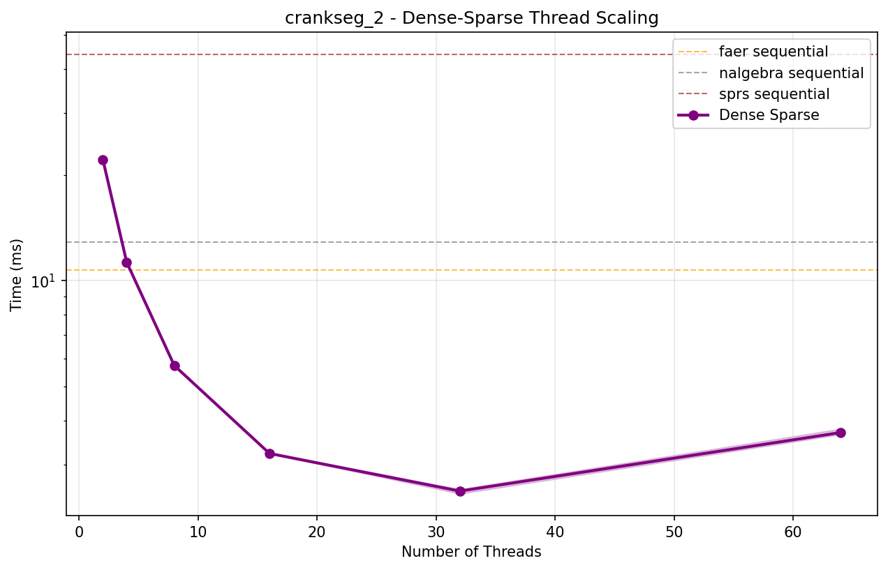
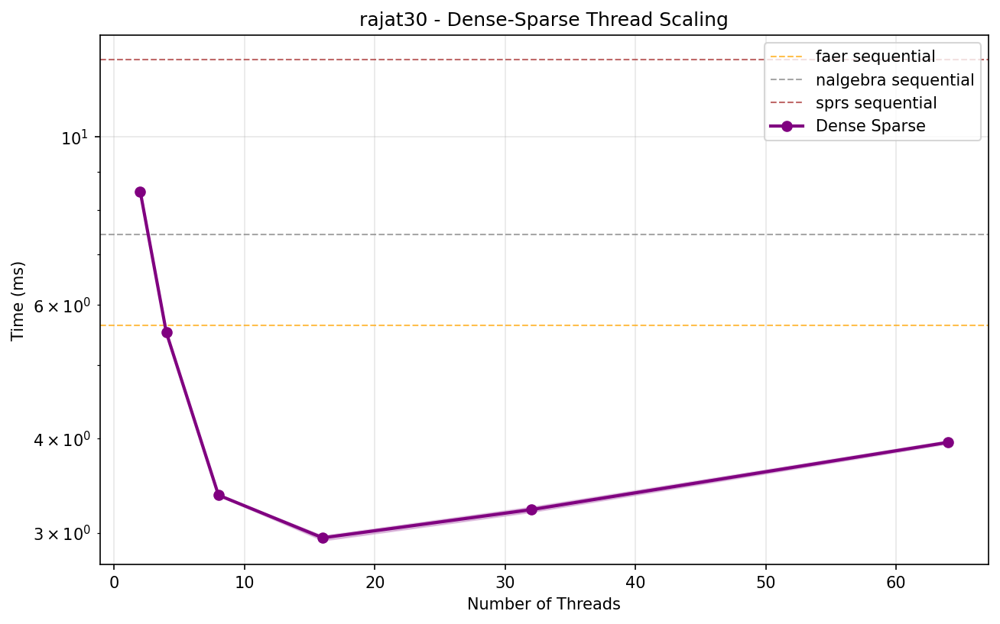
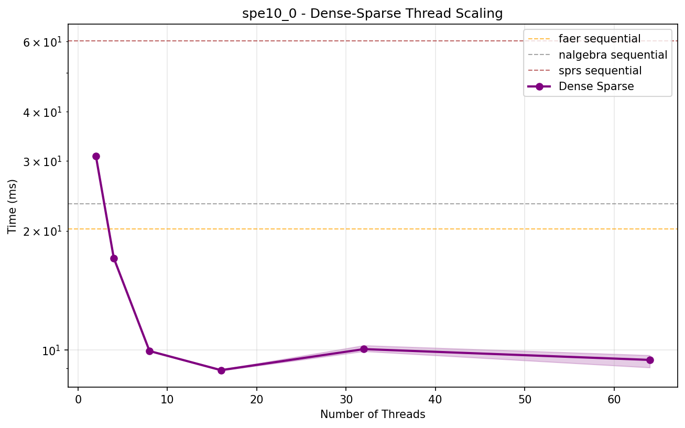

# Sequential Sparse-Dense Matrix-Vector Multiplication Benchmark Results

| Matrix | Dimensions | Non-zeros | faer | nalgebra | sprs |
|--------|------------|-----------|------|----------|------|
| **0** | 18x18 | 18 | **33.70 ns ± 0.03 ns** | 190.76 ns ± 0.08 ns | 78.70 ns ± 0.01 ns |
| **1** | 51x51 | 79 | **92.47 ns ± 0.07 ns** | 344.03 ns ± 0.04 ns | 221.29 ns ± 0.03 ns |
| **2** | 165x165 | 469 | **403.20 ns ± 0.09 ns** | 1.67 µs ± 0.12 ns | 850.40 ns ± 0.06 ns |
| **3** | 585x585 | 2,209 | **1.79 µs ± 0.07 ns** | 7.36 µs ± 0.47 ns | 3.28 µs ± 0.23 ns |
| **4** | 2193x2193 | 9,529 | **7.58 µs ± 0.25 ns** | 30.95 µs ± 1.44 ns | 13.03 µs ± 0.51 ns |
| **synthetic** | 1000x1000 | 10,000 | **6.36 µs ± 3.78 ns** | 29.36 µs ± 1.27 ns | 9.69 µs ± 0.73 ns |
| **5** | 8481x8481 | 39,529 | **31.51 µs ± 1.66 ns** | 127.75 µs ± 5.52 ns | 53.45 µs ± 1.20 ns |
| **6** | 33345x33345 | 160,969 | **131.00 µs ± 4.72 ns** | 519.94 µs ± 8.93 ns | 214.18 µs ± 23.37 ns |
| **7** | 132225x132225 | 649,609 | **530.21 µs ± 39.10 ns** | 2.10 ms ± 142.28 ns | 864.20 µs ± 78.05 ns |
| **anisotropy_3d_1r** | 84315x84315 | 1,373,557 | **945.65 µs ± 143.15 ns** | 4.14 ms ± 297.77 ns | 1.21 ms ± 94.61 ns |
| **boneS01_M** | 127224x127224 | 2,238,384 | **1.60 ms ± 161.40 ns** | 6.72 ms ± 735.16 ns | 1.94 ms ± 166.75 ns |
| **boneS01** | 127224x127224 | 5,516,602 | **3.72 ms ± 474.29 ns** | 16.77 ms ± 2.51 µs | 4.13 ms ± 619.19 ns |
| **Ga3As3H12** | 61349x61349 | 5,970,947 | **4.11 ms ± 316.34 ns** | 17.82 ms ± 7.44 µs | 4.45 ms ± 417.92 ns |
| **rajat30** | 643994x643994 | 6,175,244 | **5.75 ms ± 2.36 µs** | 21.66 ms ± 8.00 µs | 7.30 ms ± 1.14 µs |
| **m_t1** | 97578x97578 | 9,753,570 | **6.24 ms ± 485.86 ns** | 34.95 ms ± 4.56 µs | 6.84 ms ± 896.34 ns |
| **anisotropy_3d_2r** | 650621x650621 | 10,895,827 | **8.69 ms ± 7.96 µs** | 39.87 ms ± 12.17 µs | 10.30 ms ± 11.64 µs |
| **SiO2** | 155331x155331 | 11,283,503 | **8.11 ms ± 635.21 ns** | 39.48 ms ± 3.57 µs | 8.58 ms ± 531.90 ns |
| **pwtk** | 217918x217918 | 11,524,432 | **7.23 ms ± 772.02 ns** | 38.96 ms ± 4.15 µs | 8.26 ms ± 814.23 ns |
| **anisotropy_2d** | 1313281x1313281 | 11,763,231 | **10.21 ms ± 11.33 µs** | 45.42 ms ± 13.14 µs | 14.64 ms ± 20.04 µs |
| **kkt_power** | 2063494x2063494 | 12,771,361 | **14.14 ms ± 13.18 µs** | 53.74 ms ± 28.13 µs | 20.37 ms ± 21.73 µs |
| **crankseg_2** | 63838x63838 | 14,148,858 | **9.09 ms ± 926.58 ns** | 48.64 ms ± 8.40 µs | 9.86 ms ± 637.58 ns |
| **Freescale2** | 2999349x2999349 | 14,313,235 | **17.42 ms ± 6.79 µs** | 63.55 ms ± 41.54 µs | 27.51 ms ± 12.38 µs |
| **spe10_0** | 1159366x1159366 | 28,730,252 | **20.84 ms ± 1.69 µs** | 81.85 ms ± 2.91 µs | 23.02 ms ± 1.10 µs |
# Sequential Dense-Sparse Matrix-Vector Multiplication Benchmark Results

| Matrix | Dimensions | Non-zeros | faer | nalgebra | sprs |
|--------|------------|-----------|------|----------|------|
| **0** | 18x18 | 18 | **31.33 ns ± 0.03 ns** | 67.77 ns ± 0.01 ns | 82.10 ns ± 0.01 ns |
| **1** | 51x51 | 79 | **87.35 ns ± 0.02 ns** | 169.79 ns ± 0.01 ns | 225.55 ns ± 0.03 ns |
| **2** | 165x165 | 469 | **336.03 ns ± 0.03 ns** | 628.49 ns ± 0.06 ns | 868.86 ns ± 0.11 ns |
| **3** | 585x585 | 2,209 | **1.66 µs ± 0.05 ns** | 2.42 µs ± 0.13 ns | 3.43 µs ± 0.22 ns |
| **4** | 2193x2193 | 9,529 | **6.86 µs ± 0.19 ns** | 9.52 µs ± 0.62 ns | 13.76 µs ± 4.28 ns |
| **synthetic** | 1000x1000 | 10,000 | **5.45 µs ± 1.64 ns** | 7.14 µs ± 0.68 ns | 16.58 µs ± 0.69 ns |
| **5** | 8481x8481 | 39,529 | **29.50 µs ± 2.00 ns** | 38.72 µs ± 4.29 ns | 56.08 µs ± 7.65 ns |
| **6** | 33345x33345 | 160,969 | **121.94 µs ± 4.97 ns** | 160.80 µs ± 5.07 ns | 225.19 µs ± 12.53 ns |
| **7** | 132225x132225 | 649,609 | **487.19 µs ± 27.17 ns** | 655.29 µs ± 50.51 ns | 903.06 µs ± 69.36 ns |
| **anisotropy_3d_1r** | 84315x84315 | 1,373,557 | **798.70 µs ± 72.81 ns** | 1.10 ms ± 110.46 ns | 2.76 ms ± 429.06 ns |
| **boneS01_M** | 127224x127224 | 2,238,384 | **1.62 ms ± 288.75 ns** | 1.87 ms ± 108.43 ns | 4.45 ms ± 177.96 ns |
| **boneS01** | 127224x127224 | 5,516,602 | **3.88 ms ± 351.48 ns** | 4.72 ms ± 606.92 ns | 13.86 ms ± 384.44 ns |
| **Ga3As3H12** | 61349x61349 | 5,970,947 | **4.74 ms ± 569.02 ns** | 5.41 ms ± 854.78 ns | 17.50 ms ± 289.58 ns |
| **rajat30** | 643994x643994 | 6,175,244 | **5.64 ms ± 3.87 µs** | 7.43 ms ± 2.64 µs | 12.67 ms ± 2.53 µs |
| **m_t1** | 97578x97578 | 9,753,570 | **6.63 ms ± 786.48 ns** | 8.68 ms ± 1.87 µs | 28.57 ms ± 554.50 ns |
| **anisotropy_3d_2r** | 650621x650621 | 10,895,827 | **8.20 ms ± 4.85 µs** | 11.92 ms ± 6.72 µs | 22.53 ms ± 7.64 µs |
| **SiO2** | 155331x155331 | 11,283,503 | **8.84 ms ± 645.14 ns** | 12.69 ms ± 2.64 µs | 31.82 ms ± 773.62 ns |
| **pwtk** | 217918x217918 | 11,524,432 | **7.86 ms ± 1.61 µs** | 10.15 ms ± 2.75 µs | 30.38 ms ± 660.94 ns |
| **anisotropy_2d** | 1313281x1313281 | 11,763,231 | **10.31 ms ± 7.81 µs** | 15.28 ms ± 8.64 µs | 19.84 ms ± 4.26 µs |
| **kkt_power** | 2063494x2063494 | 12,771,361 | **14.35 ms ± 14.37 µs** | 22.95 ms ± 19.53 µs | 26.53 ms ± 13.71 µs |
| **crankseg_2** | 63838x63838 | 14,148,858 | **10.70 ms ± 1.36 µs** | 12.89 ms ± 3.83 µs | 44.07 ms ± 738.62 ns |
| **Freescale2** | 2999349x2999349 | 14,313,235 | **18.23 ms ± 10.00 µs** | 24.97 ms ± 8.90 µs | 31.35 ms ± 11.60 µs |
| **spe10_0** | 1159366x1159366 | 28,730,252 | **20.22 ms ± 1.55 µs** | 23.42 ms ± 3.48 µs | 60.35 ms ± 1.36 µs |

# Parallel Thread Scaling Results - Sparse-Dense Multiplication (`simple`)

| Matrix | Dimensions | Non-zeros | 2 Threads | 4 Threads | 8 Threads | 16 Threads | 32 Threads | 64 Threads |
|--------|------------|-----------|-----------:|-----------:|-----------:|-----------:|-----------:|-----------:|
| **anisotropy_3d_1r** | 84315x84315 | 1,373,557 | **1.178 ms** | 1.720 ms | 2.656 ms | 5.182 ms | 9.358 ms | 17.568 ms |
| **boneS01_M** | 127224x127224 | 2,238,384 | 1.961 ms | **1.396 ms** | 3.301 ms | 7.596 ms | 13.079 ms | 25.181 ms |
| **boneS01** | 127224x127224 | 5,516,602 | 3.022 ms | **2.807 ms** | 4.123 ms | 5.961 ms | 13.190 ms | 25.248 ms |
| **Ga3As3H12** | 61349x61349 | 5,970,947 | 3.561 ms | **2.182 ms** | 2.791 ms | 4.431 ms | 7.841 ms | 14.329 ms |
| **rajat30** | 643994x643994 | 6,175,244 | **5.997 ms** | 9.613 ms | 12.934 ms | 22.932 ms | 53.521 ms | 84.133 ms |
| **m_t1** | 97578x97578 | 9,753,570 | 4.197 ms | **2.225 ms** | 4.182 ms | 6.611 ms | 11.292 ms | 20.615 ms |
| **anisotropy_3d_2r** | 650621x650621 | 10,895,827 | **8.913 ms** | 10.466 ms | 16.218 ms | 29.897 ms | 58.631 ms | 96.402 ms |
| **SiO2** | 155331x155331 | 11,283,503 | 5.102 ms | **3.433 ms** | 4.590 ms | 10.145 ms | 17.102 ms | 31.181 ms |
| **pwtk** | 217918x217918 | 11,524,432 | 5.671 ms | **5.162 ms** | 7.297 ms | 12.558 ms | 22.406 ms | 40.955 ms |
| **anisotropy_2d** | 1313281x1313281 | 11,763,231 | **14.165 ms** | 14.981 ms | 25.664 ms | 49.752 ms | 82.302 ms | 103.043 ms |
| **kkt_power** | 2063494x2063494 | 12,771,361 | **20.019 ms** | 24.895 ms | 42.751 ms | 74.293 ms | 137.086 ms | 146.277 ms |
| **crankseg_2** | 63838x63838 | 14,148,858 | 5.365 ms | **3.471 ms** | 3.649 ms | 5.083 ms | 9.216 ms | 15.423 ms |
| **Freescale2** | 2999349x2999349 | 14,313,235 | **22.957 ms** | 35.872 ms | 46.448 ms | 78.706 ms | 117.297 ms | 149.274 ms |
| **spe10_0** | 1159366x1159366 | 28,730,252 | **14.514 ms** | 14.654 ms | 30.533 ms | 53.896 ms | 90.757 ms | 127.551 ms |

# Parallel Thread Scaling Results - Sparse-Dense Multiplication (`merge`)

| Matrix | Dimensions | Non-zeros | 2 Threads | 4 Threads | 8 Threads | 16 Threads | 32 Threads | 64 Threads |
|--------|------------|-----------|-----------:|-----------:|-----------:|-----------:|-----------:|-----------:|
| **anisotropy_3d_1r** | 84315x84315 | 1,373,557 | 54.988 ms | 25.422 ms | 12.013 ms | 6.199 ms | **3.448 ms** | 3.916 ms |
| **boneS01_M** | 127224x127224 | 2,238,384 | 91.268 ms | 42.853 ms | 20.720 ms | 9.289 ms | 5.017 ms | **4.844 ms** |
| **boneS01** | 127224x127224 | 5,516,602 | 207.268 ms | 100.250 ms | 49.727 ms | 21.554 ms | 9.779 ms | **8.010 ms** |
| **Ga3As3H12** | 61349x61349 | 5,970,947 | 214.178 ms | 107.415 ms | 54.199 ms | 25.470 ms | 12.949 ms | **8.547 ms** |
| **rajat30** | 643994x643994 | 6,175,244 | 324.679 ms | 163.944 ms | 79.630 ms | 37.329 ms | 17.760 ms | **10.933 ms** |
| **m_t1** | 97578x97578 | 9,753,570 | 308.541 ms | 147.070 ms | 69.212 ms | 31.976 ms | 14.460 ms | **11.001 ms** |
| **anisotropy_3d_2r** | 650621x650621 | 10,895,827 | 763.200 ms | 396.475 ms | 184.848 ms | 82.039 ms | 33.419 ms | **20.768 ms** |
| **SiO2** | 155331x155331 | 11,283,503 | 465.002 ms | 259.337 ms | 141.368 ms | 61.007 ms | 27.714 ms | **15.597 ms** |
| **pwtk** | 217918x217918 | 11,524,432 | 377.989 ms | 180.444 ms | 88.143 ms | 42.375 ms | 19.234 ms | **12.403 ms** |
| **anisotropy_2d** | 1313281x1313281 | 11,763,231 | 809.425 ms | 361.456 ms | 181.007 ms | 77.541 ms | 35.789 ms | **24.168 ms** |
| **kkt_power** | 2063494x2063494 | 12,771,361 | 975.454 ms | 483.624 ms | 240.553 ms | 109.980 ms | 49.125 ms | **26.578 ms** |
| **crankseg_2** | 63838x63838 | 14,148,858 | 499.170 ms | 234.328 ms | 107.159 ms | 50.480 ms | 22.448 ms | **15.361 ms** |
| **Freescale2** | 2999349x2999349 | 14,313,235 | 1037.336 ms | 503.427 ms | 265.761 ms | 128.639 ms | 59.558 ms | **35.372 ms** |
| **spe10_0** | 1159366x1159366 | 28,730,252 | 1437.739 ms | 705.445 ms | 346.115 ms | 155.297 ms | 69.582 ms | **44.990 ms** |

# Parallel Thread Scaling Results - Sparse-Dense Multiplication (`buffer_foreign`)

| Matrix | Dimensions | Non-zeros | 2 Threads | 4 Threads | 8 Threads | 16 Threads | 32 Threads | 64 Threads |
|--------|------------|-----------|-----------:|-----------:|-----------:|-----------:|-----------:|-----------:|
| **anisotropy_3d_1r** | 84315x84315 | 1,373,557 | **5.217 ms** | 8.547 ms | 12.008 ms | 19.141 ms | 30.407 ms | 54.323 ms |
| **boneS01_M** | 127224x127224 | 2,238,384 | **4.250 ms** | 4.619 ms | 7.074 ms | 22.370 ms | 35.602 ms | 58.183 ms |
| **boneS01** | 127224x127224 | 5,516,602 | 8.231 ms | **7.301 ms** | 9.288 ms | 27.443 ms | 43.519 ms | 71.422 ms |
| **Ga3As3H12** | 61349x61349 | 5,970,947 | 15.222 ms | **14.338 ms** | 21.751 ms | 31.832 ms | 45.051 ms | 75.867 ms |
| **rajat30** | 643994x643994 | 6,175,244 | **15.256 ms** | 16.779 ms | 25.734 ms | 35.870 ms | 50.078 ms | 77.418 ms |
| **m_t1** | 97578x97578 | 9,753,570 | **13.958 ms** | 21.972 ms | 20.675 ms | 35.569 ms | 49.169 ms | 77.567 ms |
| **anisotropy_3d_2r** | 650621x650621 | 10,895,827 | 36.017 ms | 26.440 ms | **23.749 ms** | 33.898 ms | 57.569 ms | 85.504 ms |
| **SiO2** | 155331x155331 | 11,283,503 | **27.374 ms** | 28.446 ms | 34.292 ms | 35.238 ms | 54.773 ms | 87.364 ms |
| **pwtk** | 217918x217918 | 11,524,432 | 18.436 ms | **15.642 ms** | 21.232 ms | 34.602 ms | 55.471 ms | 83.504 ms |
| **anisotropy_2d** | 1313281x1313281 | 11,763,231 | 41.995 ms | 31.409 ms | **25.156 ms** | 35.812 ms | 54.192 ms | 88.255 ms |
| **kkt_power** | 2063494x2063494 | 12,771,361 | 58.550 ms | **36.908 ms** | 37.834 ms | 38.576 ms | 55.739 ms | 89.464 ms |
| **crankseg_2** | 63838x63838 | 14,148,858 | 32.904 ms | **29.583 ms** | 29.953 ms | 37.467 ms | 54.488 ms | 81.432 ms |
| **Freescale2** | 2999349x2999349 | 14,313,235 | 66.778 ms | 38.397 ms | **30.730 ms** | 38.892 ms | 54.815 ms | 87.399 ms |
| **spe10_0** | 1159366x1159366 | 28,730,252 | 38.327 ms | 23.532 ms | **19.437 ms** | 42.973 ms | 71.386 ms | 102.811 ms |

# Parallel Thread Scaling Results - Dense-Sparse Multiplication (`dense_sparse`)

| Matrix | Dimensions | Non-zeros | 2 Threads | 4 Threads | 8 Threads | 16 Threads | 32 Threads | 64 Threads |
|--------|------------|-----------|-----------:|-----------:|-----------:|-----------:|-----------:|-----------:|
| **anisotropy_3d_1r** | 84315x84315 | 1,373,557 | 1.555 ms | 892.46 µs | **621.84 µs** | 637.06 µs | 1.162 ms | 2.496 ms |
| **boneS01_M** | 127224x127224 | 2,238,384 | 2.337 ms | 1.327 ms | 879.83 µs | **794.14 µs** | 1.278 ms | 2.602 ms |
| **boneS01** | 127224x127224 | 5,516,602 | 6.490 ms | 3.391 ms | 1.911 ms | **1.367 ms** | 1.903 ms | 2.770 ms |
| **Ga3As3H12** | 61349x61349 | 5,970,947 | 8.916 ms | 4.729 ms | 2.508 ms | **1.575 ms** | 1.721 ms | 2.903 ms |
| **rajat30** | 643994x643994 | 6,175,244 | 8.468 ms | 5.518 ms | 3.365 ms | **2.955 ms** | 3.220 ms | 3.951 ms |
| **m_t1** | 97578x97578 | 9,753,570 | 13.865 ms | 7.096 ms | 3.728 ms | 2.328 ms | **2.051 ms** | 3.583 ms |
| **anisotropy_3d_2r** | 650621x650621 | 10,895,827 | 12.032 ms | 6.786 ms | 4.266 ms | **3.933 ms** | 4.428 ms | 5.069 ms |
| **SiO2** | 155331x155331 | 11,283,503 | 15.575 ms | 8.803 ms | 4.634 ms | 3.081 ms | **2.385 ms** | 3.979 ms |
| **pwtk** | 217918x217918 | 11,524,432 | 13.999 ms | 7.244 ms | 3.847 ms | 2.715 ms | **2.558 ms** | 3.907 ms |
| **anisotropy_2d** | 1313281x1313281 | 11,763,231 | 14.197 ms | 8.632 ms | **6.477 ms** | 6.607 ms | 6.871 ms | 7.287 ms |
| **kkt_power** | 2063494x2063494 | 12,771,361 | 19.783 ms | 13.270 ms | 10.055 ms | **9.447 ms** | 10.223 ms | 10.924 ms |
| **crankseg_2** | 63838x63838 | 14,148,858 | 22.046 ms | 11.282 ms | 5.743 ms | 3.229 ms | **2.438 ms** | 3.779 ms |
| **Freescale2** | 2999349x2999349 | 14,313,235 | 25.521 ms | 17.482 ms | 14.631 ms | **14.065 ms** | 16.918 ms | 17.668 ms |
| **spe10_0** | 1159366x1159366 | 28,730,252 | 30.893 ms | 17.045 ms | 9.942 ms | **8.649 ms** | 8.663 ms | 9.842 ms |

## Thread Scaling Plots

### Freescale2 (2999349x2999349, 14,313,235 nnz, 0.000% dense)

<table><tr>
<td></td>
<td></td>
</tr></table>

### Ga3As3H12 (61349x61349, 5,970,947 nnz, 0.159% dense)

<table><tr>
<td></td>
<td></td>
</tr></table>

### SiO2 (155331x155331, 11,283,503 nnz, 0.047% dense)

<table><tr>
<td></td>
<td></td>
</tr></table>

### anisotropy_2d (1313281x1313281, 11,763,231 nnz, 0.001% dense)

<table><tr>
<td></td>
<td></td>
</tr></table>

### anisotropy_3d_1r (84315x84315, 1,373,557 nnz, 0.019% dense)

<table><tr>
<td></td>
<td></td>
</tr></table>

### anisotropy_3d_2r (650621x650621, 10,895,827 nnz, 0.003% dense)

<table><tr>
<td></td>
<td></td>
</tr></table>

### boneS01 (127224x127224, 5,516,602 nnz, 0.034% dense)

<table><tr>
<td></td>
<td></td>
</tr></table>

### boneS01_M (127224x127224, 2,238,384 nnz, 0.014% dense)

<table><tr>
<td></td>
<td></td>
</tr></table>

### crankseg_2 (63838x63838, 14,148,858 nnz, 0.347% dense)

<table><tr>
<td></td>
<td></td>
</tr></table>

### kkt_power (2063494x2063494, 12,771,361 nnz, 0.000% dense)

<table><tr>
<td></td>
<td></td>
</tr></table>

### m_t1 (97578x97578, 9,753,570 nnz, 0.102% dense)

<table><tr>
<td></td>
<td></td>
</tr></table>

### pwtk (217918x217918, 11,524,432 nnz, 0.024% dense)

<table><tr>
<td></td>
<td></td>
</tr></table>

### rajat30 (643994x643994, 6,175,244 nnz, 0.001% dense)

<table><tr>
<td></td>
<td></td>
</tr></table>

### spe10_0 (1159366x1159366, 28,730,252 nnz, 0.002% dense)

<table><tr>
<td></td>
<td></td>
</tr></table>

## Notes

- Times shown are median ± approximate standard deviation from Criterion benchmarks
- `faer` = faer built-in sequential sparse-dense matrix-vector multiplication
- `nalgebra` = nalgebra-sparse CSC matrix-vector multiplication
- `sprs` = sprs CSC matrix-vector multiplication
- `simple`, `merge`, `buffer_foreign` = different parallel sparse-dense algorithms
- `dense_sparse` = parallel dense-sparse matrix-vector multiplication implementation
- Thread scaling shows parallel implementation performance across different thread counts
- All measurements taken on the same system with consistent methodology
- Plots show thread scaling with 95% confidence intervals and sequential baselines

## System Information

```
Architecture:                         x86_64
CPU op-mode(s):                       32-bit, 64-bit
Address sizes:                        52 bits physical, 57 bits virtual
Byte Order:                           Little Endian
CPU(s):                               64
On-line CPU(s) list:                  0-63
Vendor ID:                            AuthenticAMD
Model name:                           AMD EPYC 9534 64-Core Processor
CPU family:                           25
Model:                                17
Thread(s) per core:                   1
Core(s) per socket:                   64
Socket(s):                            1
Stepping:                             1
Frequency boost:                      enabled
CPU(s) scaling MHz:                   78%
CPU max MHz:                          3718.0659
CPU min MHz:                          1500.0000
BogoMIPS:                             4892.78
Flags:                                fpu vme de pse tsc msr pae mce cx8 apic sep mtrr pge mca cmov pat pse36 clflush mmx fxsr sse sse2 ht syscall nx mmxext fxsr_opt pdpe1gb rdtscp lm constant_tsc rep_good amd_lbr_v2 nopl nonstop_tsc cpuid extd_apicid aperfmperf rapl pni pclmulqdq monitor ssse3 fma cx16 pcid sse4_1 sse4_2 movbe popcnt aes xsave avx f16c rdrand lahf_lm cmp_legacy svm extapic cr8_legacy abm sse4a misalignsse 3dnowprefetch osvw ibs skinit wdt tce topoext perfctr_core perfctr_nb bpext perfctr_llc mwaitx cpb cat_l3 cdp_l3 hw_pstate ssbd mba perfmon_v2 ibrs ibpb stibp ibrs_enhanced vmmcall fsgsbase bmi1 avx2 smep bmi2 erms invpcid cqm rdt_a avx512f avx512dq rdseed adx smap avx512ifma clflushopt clwb avx512cd sha_ni avx512bw avx512vl xsaveopt xsavec xgetbv1 xsaves cqm_llc cqm_occup_llc cqm_mbm_total cqm_mbm_local avx512_bf16 clzero irperf xsaveerptr rdpru wbnoinvd amd_ppin cppc arat npt lbrv svm_lock nrip_save tsc_scale vmcb_clean flushbyasid decodeassists pausefilter pfthreshold avic v_vmsave_vmload vgif x2avic v_spec_ctrl vnmi avx512vbmi umip pku ospke avx512_vbmi2 gfni vaes vpclmulqdq avx512_vnni avx512_bitalg avx512_vpopcntdq la57 rdpid overflow_recov succor smca fsrm flush_l1d debug_swap
Virtualization:                       AMD-V
L1d cache:                            2 MiB (64 instances)
L1i cache:                            2 MiB (64 instances)
L2 cache:                             64 MiB (64 instances)
L3 cache:                             256 MiB (8 instances)
NUMA node(s):                         4
NUMA node0 CPU(s):                    0-15
NUMA node1 CPU(s):                    16-31
NUMA node2 CPU(s):                    32-47
NUMA node3 CPU(s):                    48-63
Vulnerability Gather data sampling:   Not affected
Vulnerability Itlb multihit:          Not affected
Vulnerability L1tf:                   Not affected
Vulnerability Mds:                    Not affected
Vulnerability Meltdown:               Not affected
Vulnerability Mmio stale data:        Not affected
Vulnerability Reg file data sampling: Not affected
Vulnerability Retbleed:               Not affected
Vulnerability Spec rstack overflow:   Mitigation; Safe RET
Vulnerability Spec store bypass:      Mitigation; Speculative Store Bypass disabled via prctl
Vulnerability Spectre v1:             Mitigation; usercopy/swapgs barriers and __user pointer sanitization
Vulnerability Spectre v2:             Mitigation; Enhanced / Automatic IBRS; IBPB conditional; STIBP disabled; RSB filling; PBRSB-eIBRS Not affected; BHI Not affected
Vulnerability Srbds:                  Not affected
Vulnerability Tsx async abort:        Not affected
```