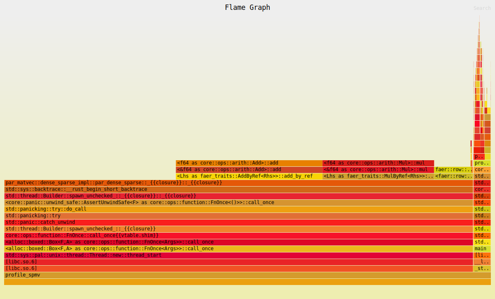
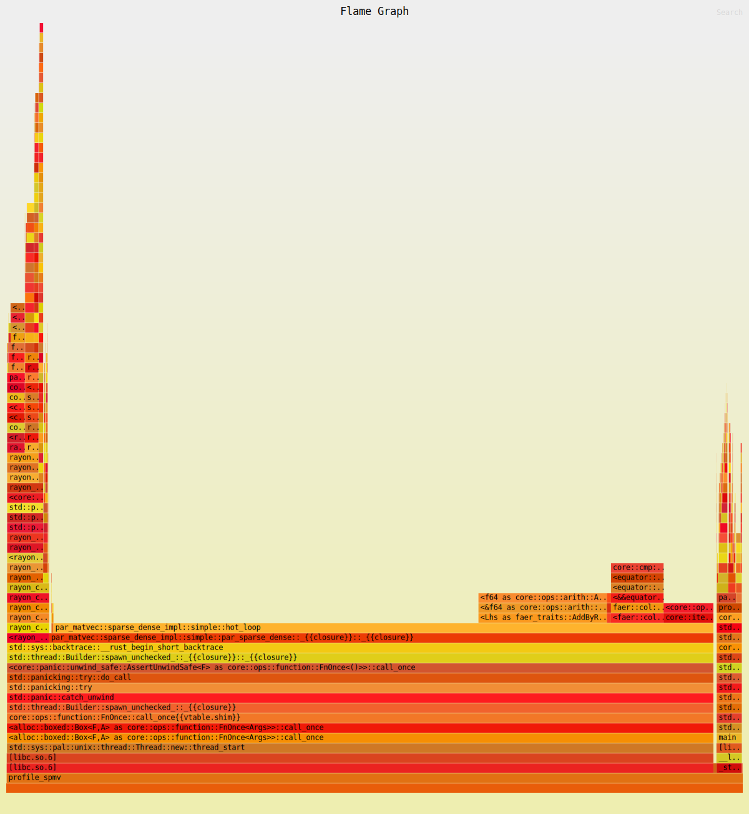
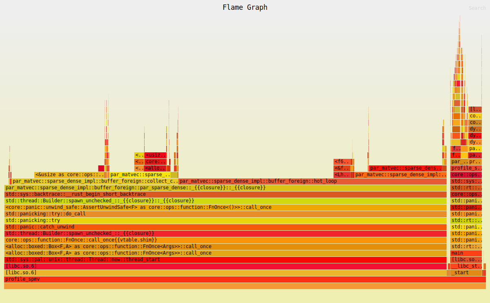

# par_matvec

A Rust library for benchmarking and testing parallel sparse matrix-vector multiplication (SpMV) operations.

## Purpose

This crate studies the performance of different sparse matrix by dense vector products (commonly referred to as "matvecs"). These operations are fundamental building blocks in numerical algorithms for solving partial differential equations (PDEs), where they often dominate the computational cost. Having efficient sequential and parallel Rust implementations is crucial for advancing scientific computing in the Rust ecosystem. Currently, I'm not aware of any performant Rust shared memory parallel SpMV implementations.

## Quick Start

Running the benchmarks and tests will require some `matrix_market` format files located in `test_matrices/**/<mat_name>.mtx`. The testing / benching utility walks this directory to find files. 

```bash
# Create some matrices in the expected locations
mkdir test_matrices
ln -s <matrix_market_file> test_matrices/<name>.mtx

# Run all benchmarks
cargo bench
# or run individual benches
cargo bench --bench sequential
cargo bench --bench parallel

# Run tests
cargo test

# (requires `matplotlib` and both sequential and parallel benches to have been run)
# Generate results tables, updates `BENCHMARK_RESULTS.md` 
python3 parse_criterion_benchmarks.py

# Profile algorithm with flamegraph (input matrix market file path)
# ALGORITHMS=("dense_sparse" "sparse_dense_simple" "sparse_dense_merge" "sparse_dense_buffer")
cargo flamegraph --release --bin profile_spmv -- "$MATRIX_PATH" "$NUM_THREADS" "$algorithm"
# or profile all algorithms using this script
./profile_all.sh <matrix_path> <num_threads>
```

See `BENCHMARKS.md` and `CORRECTNESS_TESTS.md` for more details.

## Analysis

See `BENCHMARK_RESULTS.md` for table summary of the benchmarks. 

### Sequential

`sprs` and `faer` seem about the same performance-wise, with `nalgebra` generally taking 20% - 50% longer for each matrix SpMV. 

### Parallel

 - 4 algorithms are tested in this crate for parallel SpMV. 
 - Let `A` be an `m` by `n` sparse matrix, stored in compressed sparse column format.

All algorithms have a 'planning' stage where the matrix is partitioned into parts so that each thread gets an even slice of the `row_indices` and `nnz_values` of the compressed matrix. The planning stage also determines the start and end column of this range for each thread to avoid an `O(log(n_cols))` binary search per thread to find the starting column. Let's use `A_t` to denote the portion of the sparse matrix owned by thread `t`.

#### Alg 1 --- `x^T A = y^T`: dense row vector times CSC matrix *or* `A^T x = y`: CSR matrix times dense col vector

This is the simplest algorithm. The workspace required is 2 values per thread. If thread `t` owns values starting in column `a` and ending in column `c` then for all column indices `b` such that `a < b < c` we know thread `t` can write directly to `y[b]` without race concerns. The only synchronization required is collecting all these endpoint values from the `⟨partial_col, x⟩` dot products into the output vector, hence the 2 workspace values per thread.

 - Computational complexity is the same as sequential: `O(nnz)`
 - Storage complexity is small: `O(n_threads)`

**Flamegraph Profile (SiO2 matrix, 8 threads):**


#### Alg 2 --- `A x = y`: standard CSC SpMV *or* `x^T A^T = y^T`: dense row vector times CSR

These algorithms are more challenging and generally less efficient than Alg 1, so generally Alg 1 should be preferred. The reason is that now we need to accumulate dot products along the dimension where we do not have access to the matrix values. This means that each thread will be required to write randomly to the output vector, requiring more advanced approaches to synchronization. Generally, atomic updates on every write to the output vector are inefficient.

Each of the following algorithms avoids race conditions by partitioning the output into evenly-sized blocks (denoted `y_t`) owned by each thread (in addition to the previously described matrix partition).

##### Alg 2a (`simple`)

The easiest to implement (and fastest so far) is to give each thread a workspace for the entire output vector, `w_t`. Compute `A_t x = w_t` for all the thread-owned `nnz_values`. This results in an `m` by `n_threads` dense matrix `W := [w_1 ... w_t]` which needs to be reduced by summing the columns into `y`. This reduction step can be parallelized over the `y_t` partition.

 - Computational complexity: `O(nnz)` for the first stage plus `O(m * n_threads)` for the reduction step
 - Storage complexity: `O(m * n_threads)` for the workspaces
 - Note that for very sparse matrices with large `m` the scaling is suboptimal; if `nnz_per_row < n_threads`, adding more threads will scale the computational complexity *faster* than the theoretical ideal parallelization speedup of the first stage. In these cases the workspace matrix `W` is sparse and storing it as a dense matrix can be wasteful for both space and time complexity.

**Flamegraph Profile (SiO2 matrix, 8 threads):**


##### Alg 2b (`merge`)

A well-studied approach to dealing with the hyper-sparse scaling issue of 2a is to use sparse vectors for `w_t`. Requiring the invariant that the `row_indices` are sorted for each column, we can use a `k-way` sorted merge to perform the `A_t x = w_t` where `A_t` is comprised of `k` columns. Then the resulting sparse workspace vectors can be sum-reduced into `y`. This last reduction could be done in parallel but isn't in this implementation because the current `k-way` merge implementation takes 90% of the time.

This algorithm/implementation could also be improved using the output partition `y_t`. For the values that fall into this partition for `A_t x = y_t` we can write directly to the output vector without race conditions, reducing the number of elements in the expensive merge. If the matrix has a 'good' ordering this could be a big improvement, or no improvement if the ordering is 'bad'. This leaves some room for optimization in this approach through a pre-processing reordering step, but combinatorial graph optimization problems are hard and expensive.

 - Computational complexity: `k-way` merge algorithms have a computational complexity of `O(nnz * log(k))` with `k ≈ n / n_threads`; the reduction step here has worst-case complexity of `O(nnz)` in the pathological case of each `A_t` having at most a single non-zero per row.
 - Storage complexity: Worst case is `O(nnz)` for the workspaces.
 - Generally, if `nnz < m * n_threads` or equivalently (as stated in 2a) if `nnz_per_row < n_threads`, this should theoretically be better with a good implementation, but right now it's not even close. The current implementation uses a min-heap approach for the `k-way` merge and a tournament tree would be better, but I'm not sure by how much. Every removal from the heap/tree has to check which column it came from, check which column the previous removal came from and if they match, and do the `log(k)` operations to update the heap/tree.

**Flamegraph Profile (SiO2 matrix, 8 threads):**


##### Alg 2c (`buffer_foreign`)

An approach focused on inter-thread communication can help with cache locality. This is the most complicated version by far with many knobs to tune for performance optimization. Here we partition the `y` vector into 'chunks', let's call them `y_c`. The idea is that a few chunks should easily fit into L2 cache. Each thread is then given some set of these chunks to own, providing the `y_t` partition. When `A_t x = y_t` is in an owned chunk we write to `y` on each thread. When it's not, we add the value into a 'chunk buffer' for the correct foreign chunk. The hope is that each thread only has to buffer to a few different foreign chunks to maintain L2 cache locality. Again, the performance here will heavily depend on good ordering of the matrix. When a chunk buffer fills up we set it aside into a collection of 'full chunks' and when we have enough full chunks for some chunk `c` we can send them as a batch to the owning thread. Each thread should alternate between processing `A_t x = y_t` and buffering foreign chunks and receiving batches of chunks which are sent to them. How long is optimal before switching tasks? No idea, but by tuning the chunk size, length of the chunk buffer, how many chunks to send each message, and how long to work before switching to processing chunks it *should* be possible to make this quite fast. The problem is this depends on matrix structure, CPU architecture, and many other variables so this is probably more trouble than it's worth.

An alternative approach to the inter-thread communication would be to use atomic operations on the foreign values, but this would ruin all the cache locality we worked so hard for.

 - Computational complexity: `O(nnz)`
 - Storage complexity: `O(1)` depending on chunk size and how many chunks you put in the `chunk_pool`, but realistically this should scale with `nnz` or you will starve threads of work while they wait for available empty chunks from the pool.

**Flamegraph Profile (SiO2 matrix, 8 threads):**


### Parallel Summary 

In the 'easy' case (Alg 1) there is decent scaling and the parallel implementation can be much faster than sequential on general non-pathological cases. The scaling isn't as good as I would hope given the near-zero synchronization overhead, but maybe there are some obvious optimizations available to improve this simple algorithm.

In the 'hard' case (Alg 2), the simple version 2a shows by far the best results currently for a general approach that works well enough for most problems. 2b and 2c may be better for highly sparse or structured matrices, but they need significant work in their implementations to become remotely competitive and both would likely require a pre-processing stage to reorder the matrix.

## License

See `LICENSE.md`.
